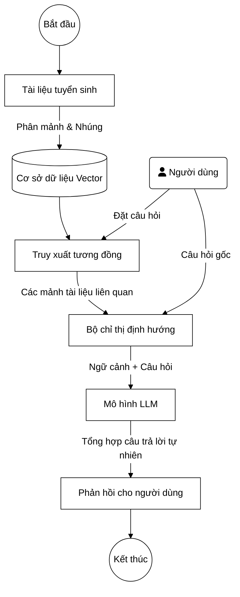

# CHƯƠNG 1: CƠ SỞ LÝ THUYẾT VÀ TỔNG QUAN NGHIÊN CỨU

## 1.1. Tổng quan về trợ lý ảo và bài toán hỏi đáp tự động

Hành trình phát triển của trợ lý ảo bắt đầu từ những năm 1960 với sự ra đời của ELIZA, một chương trình máy tính sơ khai mô phỏng kỹ thuật tâm lý trị liệu thông qua cơ chế so khớp mẫu đơn giản. Trải qua nhiều thập kỷ, trợ lý ảo đã tiến hóa mạnh mẽ. Trong giai đoạn đầu ứng dụng thương mại, hầu hết các hệ thống là chatbot hoạt động dựa trên luật. Phương pháp này yêu cầu các kỹ sư phải xây dựng thủ công hệ thống cây quyết định và kịch bản hội thoại từ khóa phức tạp. Mặc dù dễ kiểm soát, chatbot dựa trên luật bộc lộ điểm yếu chí mạng là sự cứng nhắc; hệ thống thường xuyên rơi vào bế tắc khi người dùng diễn đạt câu hỏi vượt ngoài kịch bản dự kiến. Sự ra đời của NLP truyền thống đã cải thiện phần nào tình trạng này thông qua phân loại ý định và trích xuất thực thể, nhưng vẫn bị giới hạn bởi lượng dữ liệu huấn luyện cụ thể. Cuộc cách mạng thực sự chỉ diễn ra khi các LLM xuất hiện, mang lại khả năng thấu hiểu ngữ cảnh sâu sắc và sinh ngôn ngữ tự nhiên linh hoạt, thay thế hoàn toàn cơ chế phản hồi theo mẫu định sẵn.

Dựa trên cơ chế cốt lõi, trợ lý ảo hiện đại được phân thành ba nhóm chính. Nhóm truy xuất phân tích câu hỏi người dùng để tìm kiếm và trả về nguyên văn câu trả lời phù hợp nhất từ một kho dữ liệu đóng sẵn; phương pháp này đảm bảo tính an toàn cao nhưng thiếu sự uyển chuyển. Nhóm sinh văn bản tự động cấu tạo câu trả lời theo từng từ dựa trên xác suất ngôn ngữ học, cho phép tạo ra các đoạn hội thoại đa dạng, tự nhiên nhưng lại tiềm ẩn rủi ro sinh ra thông tin sai lệch. Nhóm lai là sự giao thoa giữa hai cơ chế trên, vừa đảm bảo tính chính xác nhờ truy xuất thông tin thực tế, vừa giữ được sự tự nhiên nhờ khả năng sinh ngôn ngữ.

Việc ứng dụng trợ lý ảo vào lĩnh vực giáo dục, cụ thể là công tác tuyển sinh, thuộc phạm trù bài toán hỏi đáp miền tri thức chuyên biệt. Khác với các hệ thống hỏi đáp đa miền có thể trả lời các câu hỏi thường thức chung chung, hệ thống miền chuyên biệt đòi hỏi sự am hiểu sâu sắc về một ranh giới dữ liệu cụ thể. Thách thức lớn nhất của bài toán này nằm ở yêu cầu cực kỳ khắt khe về độ chính xác. Bất kỳ sai sót nào trong việc tư vấn mã ngành, tổ hợp xét tuyển, hay điểm chuẩn đều có thể ảnh hưởng trực tiếp đến tương lai học tập của thí sinh. Do đó, hệ thống không chỉ cần khả năng hiểu câu hỏi đa dạng của người dùng mà còn phải sở hữu cơ chế đối chiếu tri thức nghiêm ngặt, đảm bảo mọi phản hồi đều dựa trên nguồn gốc thông tin chính thống từ nhà trường.

## 1.2. Mô hình ngôn ngữ lớn

LLM đại diện cho bước tiến vượt bậc trong lĩnh vực AI, đánh dấu sự chuyển dịch từ các hệ thống phân tích ngôn ngữ thống kê sang các mạng nơ-ron học sâu với quy mô hàng trăm tỷ tham số. Thành tựu này có được nhờ sự ra đời của kiến trúc Transformer. Khác biệt cốt lõi của Transformer so với các kiến trúc tuần tự như RNN hay LSTM nằm ở cơ chế tự chú ý. Cơ chế này cho phép mô hình đánh giá mức độ quan trọng của mọi từ trong câu đối với từng từ khác cùng một lúc, giải quyết triệt để rào cản phụ thuộc xa mà các mô hình cũ gặp phải. Thay vì xử lý từ trái sang phải, Transformer xử lý toàn bộ chuỗi đầu vào song song, kết hợp với cơ chế mã hóa vị trí để duy trì cấu trúc ngữ pháp. Khả năng song song hóa này không chỉ giúp mô hình thấu hiểu ngữ cảnh rộng lớn mà còn tối ưu hóa thời gian huấn luyện trên các cụm tính toán phần cứng khổng lồ.

Vòng đời của một LLM trải qua nhiều giai đoạn huấn luyện phức tạp. Giai đoạn tiền huấn luyện tiêu tốn nhiều tài nguyên nhất, trong đó mô hình tiêu thụ một lượng văn bản khổng lồ từ Internet để học các quy luật thống kê của ngôn ngữ, từ vựng và kiến thức tổng quát dưới dạng dự đoán từ tiếp theo. Tuy nhiên, mô hình tiền huấn luyện chỉ giỏi hoàn thiện văn bản chứ chưa biết cách tuân theo chỉ thị. Do đó, giai đoạn tinh chỉnh theo chỉ thị được áp dụng để rèn luyện mô hình cách trả lời câu hỏi và thực hiện các tác vụ cụ thể. Để mô hình thực sự hành xử an toàn và bám sát giá trị con người, giai đoạn RLHF được thực thi, giúp mô hình biết cách ưu tiên các câu trả lời hữu ích, lịch sự và từ chối các yêu cầu độc hại.

Dù sở hữu năng lực ngôn ngữ mạnh mẽ, LLM vẫn bộc lộ ba hạn chế cốt lõi ảnh hưởng trực tiếp đến việc ứng dụng trong hệ thống tuyển sinh. Hạn chế nghiêm trọng nhất là hiện tượng ảo giác. Do bản chất sinh văn bản theo xác suất thay vì tra cứu cơ sở dữ liệu cứng, LLM có thể tự động tạo ra những thông tin nghe rất hợp lý nhưng thực chất hoàn toàn sai lệch. Việc sinh sai điểm chuẩn hoặc bịa đặt một mã ngành xét tuyển sẽ gây ra rủi ro pháp lý và uy tín rất lớn cho nhà trường. Hạn chế thứ hai là kiến thức bị đóng băng; một LLM huấn luyện xong vào năm 2023 sẽ hoàn toàn không biết gì về đề án tuyển sinh năm 2024. Hạn chế thứ ba liên quan đến cửa sổ ngữ cảnh; mặc dù các mô hình hiện đại đã mở rộng cửa sổ này lên đáng kể, nhưng việc nhồi nhét toàn bộ 86 tệp quy chế tuyển sinh hàng trăm trang vào từng lượt hỏi đáp là bất khả thi về mặt kỹ thuật và cực kỳ tốn kém về mặt chi phí API.

## 1.3. Kỹ thuật RAG

Kỹ thuật RAG được giới thiệu lần đầu vào năm 2020 nhằm khắc phục trực tiếp ba điểm yếu chí mạng của LLM: ảo giác, kiến thức đóng băng và giới hạn cửa sổ ngữ cảnh. RAG hoạt động dựa trên triết lý cung cấp tài liệu mở cho LLM trong lúc làm bài kiểm tra, thay vì bắt mô hình phải thi đóng sách. Khi hệ thống nhận được câu hỏi, thay vì để LLM tự suy đoán từ kiến thức nội tại, RAG sẽ ưu tiên tìm kiếm các đoạn văn bản chính thống liên quan nhất từ kho tri thức bên ngoài. Các đoạn văn bản này sau đó được cung cấp cho LLM như một bối cảnh tham chiếu bắt buộc, định hướng mô hình sinh ra câu trả lời dựa trên sự thật thay vì xác suất tĩnh.

Kiến trúc tổng quát của RAG vận hành qua ba giai đoạn tuyến tính. Giai đoạn lập chỉ mục chạy nền để xử lý các tài liệu gốc, phân chia văn bản thành các mảnh nhỏ và biến đổi chúng thành các vector số học lưu trữ trong cơ sở dữ liệu. Giai đoạn truy xuất diễn ra theo thời gian thực khi người dùng đặt câu hỏi; hệ thống biến câu hỏi thành vector và tiến hành tính toán khoảng cách để tìm ra các mảnh văn bản có ngữ nghĩa tương đồng nhất. Giai đoạn sinh văn bản kết nối các mảnh thông tin vừa truy xuất cùng với câu hỏi ban đầu, đẩy vào LLM để tổng hợp thành một phản hồi tự nhiên, liền mạch và hoàn toàn khả tín.

Để thấy rõ ưu việt của RAG, cần đặt kỹ thuật này lên bàn cân so sánh với các phương pháp kiểm soát LLM hiện hành, cụ thể là tinh chỉnh mô hình và thiết kế chỉ thị thuần túy.

Bảng 1.1: So sánh các phương pháp điều khiển LLM

| Tiêu chí | Tinh chỉnh mô hình (Fine-tuning) | Kỹ thuật RAG | Kỹ thuật thiết kế chỉ thị thuần |
|----------|---------------------------------|--------------|--------------------------------|
| **Chi phí cập nhật** | Rất cao (phải thu thập tập dữ liệu lớn và huấn luyện lại cấu trúc mạng) | Rất thấp (chỉ cần thêm tài liệu mới vào cơ sở dữ liệu vector) | Thấp (chỉnh sửa nội dung chỉ thị) |
| **Khả năng truy xuất nguồn** | Không (kiến thức bị hòa tan vào các trọng số ma trận) | Có (hệ thống cung cấp chính xác văn bản gốc dùng làm căn cứ) | Không |
| **Yêu cầu phần cứng** | Cao (đòi hỏi cụm GPU chuyên dụng cho huấn luyện) | Thấp (hoạt động tốt với CPU hoặc GPU cơ bản cho bước truy xuất) | Thấp |
| **Mức độ phù hợp dữ liệu động** | Không phù hợp (kiến thức lạc hậu nhanh chóng) | Rất phù hợp (đồng bộ ngay lập tức khi thay đổi quy chế) | Hạn chế (do cửa sổ ngữ cảnh không thể chứa lượng tài liệu lớn) |

Theo thời gian, RAG đã phân nhánh thành nhiều biến thể nâng cao. Phiên bản RAG Nguyên thủy (Naive RAG) chỉ đơn giản là tìm kiếm và kết hợp, tuy dễ triển khai nhưng thường gặp khó khăn với các câu hỏi phức tạp hoặc dữ liệu nhiễu. RAG Nâng cao (Advanced RAG) bổ sung các kỹ thuật phức tạp trước và sau quá trình truy xuất như: viết lại câu hỏi để chuẩn hóa ngôn ngữ người dùng, tìm kiếm lai kết hợp từ khóa và ngữ nghĩa, và sắp xếp lại kết quả để tối ưu độ liên quan. Gần đây nhất, RAG Mô-đun (Modular RAG) cung cấp kiến trúc linh hoạt, cho phép tháo lắp và cấu hình linh động nhiều thành phần truy xuất tùy thuộc vào luồng xử lý. Đề tài này áp dụng kiến trúc RAG Nâng cao, đặc biệt tập trung tối ưu hóa khâu tiền xử lý dữ liệu và thiết kế bộ chỉ thị định hướng nhằm xử lý triệt để bài toán tuyển sinh tiếng Việt.

*Hình 1.1: Sơ đồ kiến trúc RAG cơ bản áp dụng trong hệ thống*

## 1.4. Cơ sở dữ liệu vector và kỹ thuật nhúng

Trái tim của hệ thống truy xuất thông tin ngữ nghĩa chính là kỹ thuật nhúng văn bản. Nhúng là quá trình sử dụng các mạng nơ-ron học sâu để ánh xạ văn bản từ định dạng chuỗi ký tự rời rạc sang định dạng các vector liên tục trong không gian đa chiều (thường từ vài trăm đến vài ngàn chiều). Trong không gian này, các khái niệm có ý nghĩa tương tự nhau sẽ được hệ thống mã hóa thành những vector nằm gần nhau. Quá trình này giúp hệ thống vượt qua rào cản của việc so khớp từ khóa chính xác. Nhờ biểu diễn dưới dạng tọa độ hình học, máy tính có thể hiểu rằng ngành công nghệ thông tin và ngành IT mang chung một hàm ý, dù không có từ vựng nào trùng khớp.

Sự đa dạng của các mô hình nhúng hiện nay mang lại nhiều lựa chọn nhưng cũng đặt ra yêu cầu đánh giá khắt khe, đặc biệt là với tiếng Việt. Các mô hình từ OpenAI (text-embedding-3) thể hiện độ chính xác tổng quát xuất sắc nhưng thường tối ưu mạnh mẽ nhất cho tiếng Anh. Trong khi đó, một số nghiên cứu khác tại TLU đã thử nghiệm thành công mô hình mã nguồn mở như `SentenceTransformer` (biến thể MPNET v2) hay `OpenCLIP` phục vụ nhúng đa phương thức. Các mô hình này cung cấp giải pháp miễn phí và riêng tư nhưng đôi khi không nắm bắt hoàn hảo các thuật ngữ hành chính đặc thù của Việt Nam nếu không được tinh chỉnh. Mô hình Gemini Embedding của Google nổi bật nhờ khả năng xử lý đa ngôn ngữ vượt trội, bao gồm tiếng Việt. Được huấn luyện đồng bộ với tư duy của LLM Gemini, mô hình này giúp giảm thiểu độ lệch ngữ nghĩa giữa giai đoạn truy xuất và giai đoạn sinh văn bản, trở thành một nền tảng mã hóa rất phù hợp cho đề tài so với các phương pháp nhúng truyền thống.

Khi các đoạn văn bản đã được chuyển thành vector, bài toán đặt ra là làm sao để lưu trữ và tìm kiếm chúng hiệu quả. Đó là nhiệm vụ của cơ sở dữ liệu vector. Khác với cơ sở dữ liệu quan hệ dùng bảng và khóa ngoại, cơ sở dữ liệu vector tính toán độ tương đồng giữa câu hỏi và tài liệu thông qua các phép đo khoảng cách hình học, phổ biến nhất là khoảng cách L2 và độ tương đồng Cosine. Để không phải so sánh câu hỏi với hàng triệu vector một cách rà quét (vốn rất chậm), các cơ sở dữ liệu này áp dụng các thuật toán lập chỉ mục không gian chuyên dụng như IVF hay HNSW, giúp khoanh vùng tìm kiếm và trả kết quả trong phần nghìn giây.

Quá trình lựa chọn cơ sở dữ liệu vector phù hợp đòi hỏi việc xem xét kỹ lưỡng cấu trúc dự án. Bảng so sánh dưới đây phân tích các lựa chọn phổ biến hiện nay:

Bảng 1.2: So sánh các hệ quản trị cơ sở dữ liệu vector

| Hệ quản trị | Mô hình triển khai | Kiến trúc cốt lõi | Mức độ phù hợp với Đề tài |
|-------------|--------------------|-------------------|---------------------------|
| **ChromaDB** | Cục bộ / Tự lưu trữ (Local / Self-hosted) | Tối ưu hóa SQLite + DuckDB, nhẹ, dễ tích hợp Python | **Rất phù hợp**: Dễ dàng tích hợp trực tiếp vào dự án, không phát sinh chi phí hạ tầng ảo hóa phức tạp, xử lý mượt mà bộ dữ liệu vừa và nhỏ (hàng ngàn chunk). |
| **Pinecone** | Đám mây toàn phần (SaaS) | Kiến trúc độc quyền đóng | **Không phù hợp**: Phụ thuộc nền tảng bên ngoài, có nguy cơ lộ lọt dữ liệu hành chính ra máy chủ nước ngoài, chi phí duy trì cao. |
| **Weaviate** | Cục bộ / Đám mây | Nền tảng GraphQL, Graph-Vector database | **Ít phù hợp**: Kiến trúc quá đồ sộ, cần hệ sinh thái Docker phức tạp, dư thừa chức năng so với quy mô dữ liệu tuyển sinh. |
| **Milvus** | Cục bộ / Đám mây | Kiến trúc phân tán quy mô tỷ vector | **Không phù hợp**: Được thiết kế riêng cho hệ thống phân tán khổng lồ, chi phí cấu hình và duy trì máy chủ quá lớn đối với quy mô một trường đại học. |
| **Supabase (pgvector)** | Đám mây / Tự lưu trữ | Cơ sở dữ liệu quan hệ PostgreSQL tích hợp vector | **Có thể cân nhắc**: Một số giải pháp RAG nội bộ tại trường đã dùng thành công Supabase để kết hợp lưu trữ cả siêu dữ liệu phức tạp lẫn vector, tuy nhiên phụ thuộc vào kết nối mạng nếu dùng bản đám mây. |
| **FAISS** | Thư viện cục bộ | Thư viện tìm kiếm vector nội bộ siêu tốc | **Có thể cân nhắc**: Rất nhẹ và phù hợp cho các nghiên cứu RAG cục bộ nhỏ như tư vấn hướng nghiệp, nhưng thiếu các tính năng quản trị cơ sở dữ liệu hoàn chỉnh như ChromaDB. |

## 1.5. Tổng quan nghiên cứu liên quan

Nghiên cứu và ứng dụng AI trong giáo dục, đặc biệt là thông qua các trợ lý ảo hỗ trợ người dùng, đang là xu hướng được quan tâm mạnh mẽ trên thế giới. Tại Hoa Kỳ, Đại học Bang Georgia (GSU) đã triển khai hệ thống Pounce từ sớm, một chatbot đóng vai trò cung cấp thông tin tuyển sinh, nhắc nhở nộp học phí và hỗ trợ đăng ký môn học. Kết quả cho thấy Pounce đã góp phần giảm 21% tỷ lệ học sinh trúng tuyển nhưng không nhập học. Tại Úc, Đại học Deakin ra mắt Genie, ứng dụng tư vấn đa nền tảng kết hợp nhận dạng giọng nói, giúp người dùng tra cứu thời khóa biểu và dịch vụ thư viện. Phần lớn các giải pháp quốc tế này được xây dựng trên bộ quy tắc tĩnh hoặc mô hình trích xuất từ khóa, hoạt động cực kỳ ổn định nhờ vào các khung phần mềm thương mại từ IBM Watson hay Dialogflow, nhưng lại đòi hỏi một đội ngũ khổng lồ để cấu hình hàng ngàn nhánh ý định theo cách thủ công.

Tại Việt Nam, cuộc đua số hóa khâu tư vấn cũng diễn ra sôi động. Một số trường đại học tiên phong như Đại học FPT hay Đại học Kinh tế TP.HCM (UEH) đã tích hợp các chatbot trên nền tảng Fanpage hoặc Website. Những hệ thống này đáp ứng tốt các luồng tra cứu theo kịch bản có sẵn, ví dụ như người dùng bấm nút Tìm hiểu điểm chuẩn và hệ thống trả về bảng điểm tĩnh. Tuy nhiên, khi đối diện với các câu hỏi diễn đạt đa dạng có yếu tố cá nhân hóa, ví dụ: "Em ở tỉnh lẻ, được cộng điểm ưu tiên khu vực 1, thi khối A00 được 24 điểm thì cơ hội vào ngành Công nghệ thông tin là bao nhiêu?", các chatbot truyền thống này thường rơi vào trạng thái bế tắc và đẩy luồng chat về phía tư vấn viên con người. Hầu hết các đồ án tốt nghiệp hiện tại về chatbot tuyển sinh đều dựa trên kỹ thuật đối sánh mẫu hoặc phân loại ý định dùng các mô hình BERT quy mô nhỏ, chưa thực sự khai thác năng lực sinh câu tự nhiên.

Thông qua quá trình tổng quan, nghiên cứu nhận thấy một khoảng trống công nghệ đáng kể trong mảng tư vấn tuyển sinh tại Việt Nam. Sự vắng bóng của các hệ thống ứng dụng kiến trúc RAG chuyên sâu cho dữ liệu tiếng Việt đa cấp độ (Đại học, Thạc sĩ, Tiến sĩ) tạo ra một điểm nghẽn về trải nghiệm người dùng. Các bảng biểu phức tạp và văn bản hành chính dài dòng vẫn là thách thức lớn mà các hệ thống hỏi đáp chưa giải quyết triệt để. 

Đồ án này kỳ vọng sẽ lấp đầy khoảng trống đó bằng một hệ thống thực tế có khả năng thấu hiểu dữ liệu tuyển sinh không qua cấu hình thủ công. Điểm khác biệt lớn nhất là đề tài tập trung giải quyết bài toán chia tách cấu trúc bảng biểu trong tiếng Việt và ứng dụng mô hình RAG để sinh câu trả lời trực tiếp thay vì chỉ dẫn link tải tài liệu. Hệ thống kỳ vọng mang lại một khuôn mẫu kiến trúc linh hoạt, có thể triển khai cục bộ và đáp ứng trọn vẹn luồng tương tác thực tế của người dùng trên môi trường mạng xã hội.

## 1.6. Các công nghệ và công cụ sử dụng trong đề tài

Triển khai một hệ thống RAG không chỉ dựa vào một mô hình đơn lẻ mà đòi hỏi sự liên kết chặt chẽ giữa nhiều công nghệ chuyên biệt. Ở lớp điều phối trung tâm, hệ thống ứng dụng LangChain. Sự lựa chọn này dựa trên ưu điểm vượt trội của LangChain trong việc cung cấp một bộ công cụ tiêu chuẩn để tạo các chuỗi xử lý linh hoạt, hỗ trợ liền mạch từ khâu chia nhỏ văn bản đến khâu truy vấn LLM. So với các giải pháp khác như LlamaIndex (mạnh về tổ chức dữ liệu dạng cây phức tạp), LangChain mang tính mô-đun cao hơn, hỗ trợ tốt nhất cho việc kết hợp tùy biến giữa các công cụ xử lý.

Đóng vai trò là bộ não ngôn ngữ của toàn bộ hệ thống, đề tài sử dụng API của Google Gemini. Cụ thể, mô hình gemini-3.1-flash-lite đảm nhận việc tổng hợp và sinh phản hồi, trong khi text-embedding-004 phụ trách mã hóa không gian vector. Sự đồng nhất trong hệ sinh thái của Google giúp giảm thiểu tối đa hiện tượng sai lệch ngữ nghĩa giữa khâu nhúng và khâu sinh. Quan trọng hơn, dòng mô hình Flash được thiết kế để tối ưu hóa tốc độ và giảm độ trễ, một yếu tố sống còn để đảm bảo sự mượt mà trong giao tiếp trực tuyến với người dùng.

Về mặt hạ tầng máy chủ dữ liệu, ChromaDB được lựa chọn làm cơ sở dữ liệu vector nền tảng. Như đã phân tích, cơ sở dữ liệu mã nguồn mở này hoạt động ổn định trên môi trường cục bộ, đáp ứng trọn vẹn nhu cầu mở rộng quy mô dữ liệu của trường mà không phát sinh thêm bất kỳ chi phí duy trì máy chủ đám mây nào.

Tầng giao tiếp và điều khiển backend được xây dựng hoàn toàn bằng ngôn ngữ Python thông qua khung lập trình FastAPI. Việc từ bỏ các khung phần mềm truyền thống như Flask hay Django để chuyển sang FastAPI mang ý nghĩa chiến lược về mặt kiến trúc. Khả năng hỗ trợ xử lý bất đồng bộ async/await của FastAPI giúp máy chủ có thể xử lý đồng thời hàng trăm lượt truy vấn cùng lúc mà không làm nghẽn hệ thống. Đặc biệt, tính năng Server-Sent Events (SSE) của FastAPI cho phép truyền trực tiếp các đoạn văn bản đang được LLM sinh ra về thiết bị người dùng theo thời gian thực, tạo hiệu ứng phản hồi tức thời thay vì bắt người dùng phải chờ hệ thống trả lời toàn bộ một lần.

Bổ trợ cho các thành phần cốt lõi là một tập hợp các thư viện xử lý tài liệu mạnh mẽ. BeautifulSoup4 được triển khai để thu thập và làm sạch cấu trúc HTML từ cổng thông tin tuyển sinh. Để thâm nhập vào các văn bản hành chính lưu trữ truyền thống, thư viện PyPDF và Docx2txt được sử dụng để bóc tách triệt để dữ liệu dạng chữ ký tự từ các định dạng tệp thông dụng. Đồng thời, thư viện python-docx được khai thác để cấu trúc hóa lại các phản hồi hoặc xử lý quá trình định dạng văn bản phục vụ cho việc sinh tự động các báo cáo liên quan. Sự kết hợp đồng bộ của các công nghệ hiện đại này tạo nên nền móng kỹ thuật vững chắc để hiện thực hóa các mục tiêu đã đề ra.
