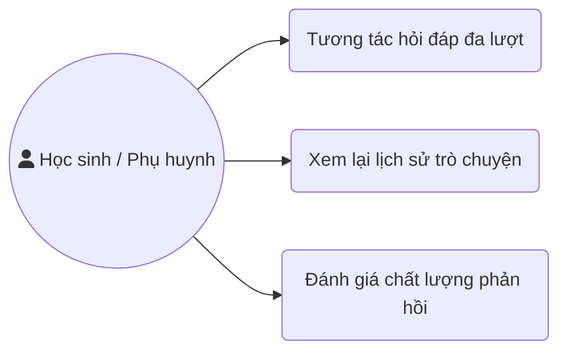
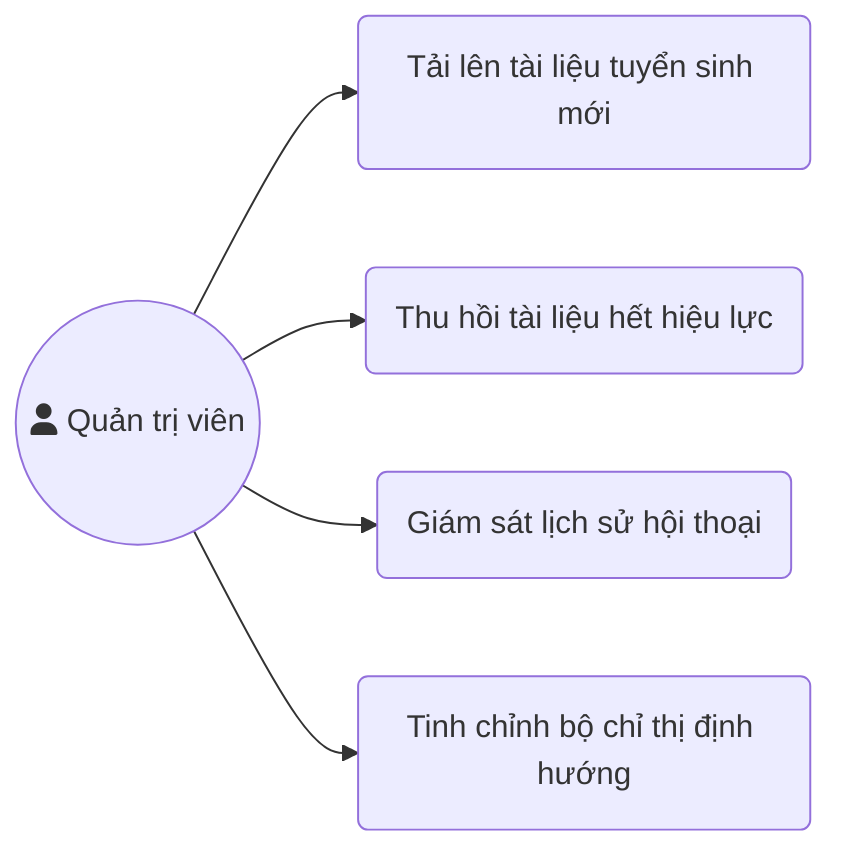
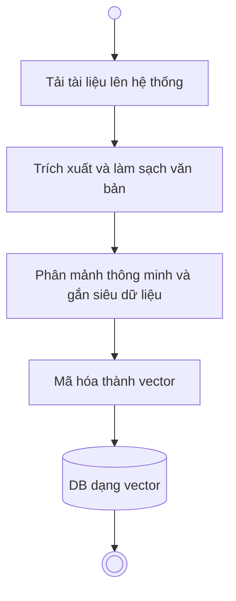
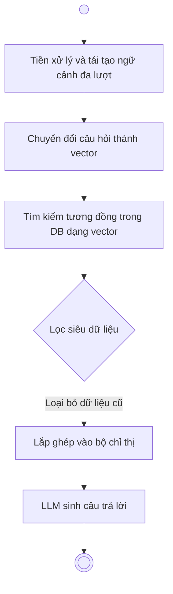
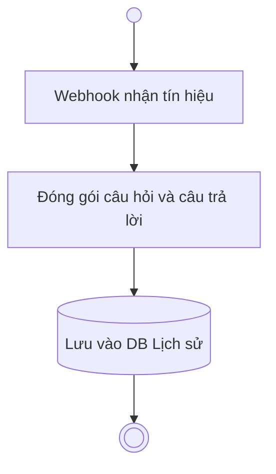
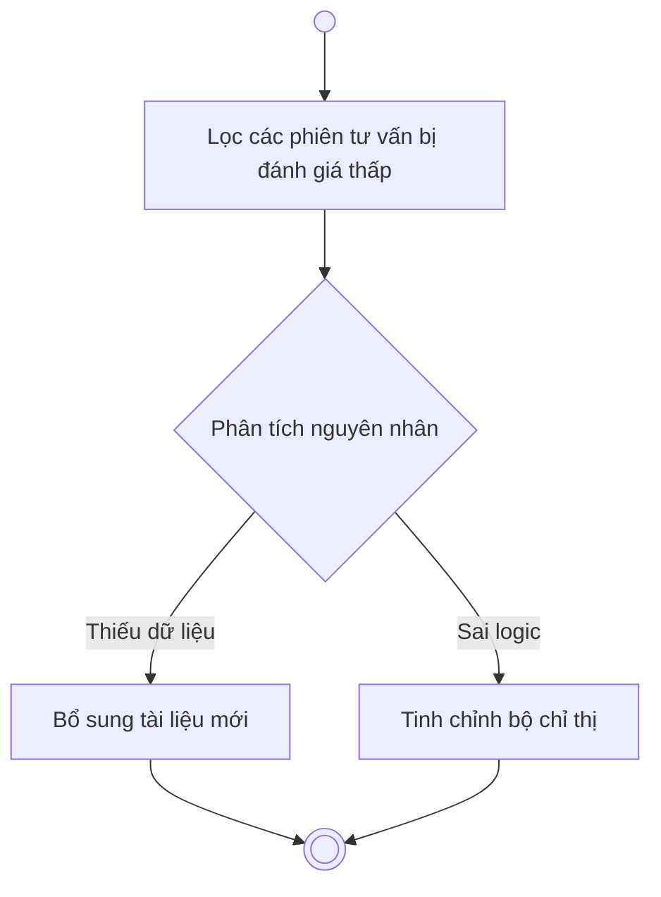

# CHƯƠNG 2: PHÂN TÍCH VÀ THIẾT KẾ HỆ THỐNG

## 2.1. Phân tích yêu cầu hệ thống
Để xây dựng một hệ thống trợ lý ảo hoạt động ổn định và đáp ứng đúng nhu cầu thực tế, việc xác định rõ các yêu cầu chức năng và phi chức năng là bước bản lề cốt lõi. Đối với người dùng cuối, tức là học sinh và phụ huynh, hệ thống phải cung cấp giao diện trò chuyện thân thiện trên nền tảng Zalo Bot. Hệ thống cần có khả năng tiếp nhận câu hỏi bằng ngôn ngữ tự nhiên, hiểu đúng ý định và đưa ra câu trả lời chính xác dựa trên thông tin tuyển sinh. Đặc biệt, người dùng cần có thể xem lại lịch sử trò chuyện và nhận được các đường dẫn tham chiếu đến tài liệu gốc để kiểm chứng thông tin.

Đối với quản trị viên, yêu cầu chức năng tập trung vào khả năng quản lý và cập nhật CSTT. Hệ thống cần cung cấp một giao diện quản trị cho phép tải lên các tài liệu mới dưới dạng văn bản, tự động băm nhỏ và nhúng các tài liệu này vào DB dạng vector. Quản trị viên cũng cần công cụ để theo dõi hiệu suất của Chatbot, xem lại các câu hỏi chưa được trả lời thỏa đáng để liên tục tinh chỉnh chất lượng phản hồi.

Về yêu cầu phi chức năng, tính chính xác được đặt lên hàng đầu nhằm tránh những rủi ro khi cung cấp sai thông tin quy chế hoặc điểm chuẩn. Hệ thống cũng phải đáp ứng yêu cầu về độ trễ, đảm bảo sinh câu trả lời trong khoảng thời gian đủ ngắn để duy trì luồng hội thoại tự nhiên. Khả năng mở rộng cũng là một tiêu chí bắt buộc để hệ thống có thể chịu tải trong những đợt cao điểm của mùa tuyển sinh khi lưu lượng truy cập tăng đột biến.

## 2.2. Phân tích dữ liệu tuyển sinh Trường Đại học Thủy Lợi
Dữ liệu tuyển sinh của nhà trường đóng vai trò là nguồn nguyên liệu cốt lõi, quyết định trực tiếp đến mức độ thông minh và độ tin cậy của toàn bộ hệ thống RAG. Thông qua quá trình khảo sát và đánh giá nguồn dữ liệu thực tế tại Trường Đại học Thủy Lợi, một số thách thức đặc thù và các điểm nghẽn nghiêm trọng đã được nhận diện, đòi hỏi hệ thống phải có chiến lược xử lý dữ liệu chuyên sâu.

Vấn đề nổi cộm hàng đầu là tính phân tán và sự thiếu đồng nhất về định dạng dữ liệu. Thông tin tuyển sinh hiện được lưu trữ rải rác trên nhiều kênh khác nhau, từ các bài viết trên website chính thức, các bài đăng trên mạng xã hội, cho đến các cẩm nang tuyển sinh dưới dạng tệp dữ liệu hỗn hợp. Việc tồn tại quá nhiều định dạng khiến quá trình tự động bóc tách nội dung gặp rào cản lớn, đòi hỏi hệ thống tiền xử lý phải tích hợp nhiều công cụ phân tích cấu trúc tài liệu phức tạp.

Thách thức nghiêm trọng tiếp theo nằm ở việc trích xuất các dữ liệu có cấu trúc bảng biểu. Những thông tin quan trọng nhất đối với thí sinh như chỉ tiêu tuyển sinh, mã ngành hay bảng điểm chuẩn qua các năm thường được trình bày dưới dạng bảng với nhiều ô gộp phức tạp. Khi các công cụ phân tích tự động quét qua, cấu trúc không gian của bảng biểu dễ bị phá vỡ, biến thành các dòng văn bản lộn xộn. Sự mất mát thông tin cấu trúc này khiến LLM không thể đối chiếu chính xác giữa tên ngành và mức điểm tương ứng.

Bên cạnh cấu trúc vật lý, sự thiếu hụt ngữ cảnh khi phân đoạn dữ liệu cũng là một rủi ro lớn. Khi tài liệu được chia nhỏ thành các khối văn bản để nhúng vào DB dạng vector, nhiều đoạn dữ liệu bị cắt rời khỏi tiêu đề gốc. Ví dụ thực tế cho thấy các thông báo học phí thường chỉ liệt kê các mức thu mà thiếu đi thông tin đi kèm như năm học áp dụng hoặc phân hệ cơ sở đào tạo. Tình trạng này dẫn đến việc CSTT lưu trữ các mức học phí của nhiều năm khác nhau với độ tương đồng ngữ nghĩa cực cao. Khi người dùng đặt câu hỏi, hệ thống rất dễ truy xuất nhầm thông tin cũ nếu không được bổ sung ngữ cảnh chặt chẽ, dẫn đến các câu trả lời thiếu nhất quán.

Một yếu tố gây nhiễu khác xuất phát từ sự xung đột thông tin theo dòng thời gian. Các kho lưu trữ của nhà trường thường bảo lưu toàn bộ các bài đăng từ nhiều năm trước để làm tài liệu tham khảo. Nếu không có cơ chế gán nhãn thời gian và lọc dữ liệu vòng ngoài, CSTT sẽ bị pha loãng bởi các thông tin đã hết hiệu lực. Sự tồn tại song song của các bộ quy chế hay mức điểm chuẩn thuộc nhiều năm khác nhau sẽ gây nhiễu loạn cho mô hình, khiến hệ thống mất phương hướng trong việc xác định đâu là thông tin mang tính cập nhật nhất để phản hồi cho học sinh.

Một rào cản kỹ thuật tiếp theo đến từ sự chênh lệch từ vựng giữa văn bản hành chính và ngôn ngữ người dùng. Các tài liệu tuyển sinh chính thống luôn sử dụng văn phong chuẩn mực và tên gọi đầy đủ của ngành học. Ngược lại, học sinh thường có thói quen đặt câu hỏi không dấu, sử dụng từ viết tắt hoặc tiếng lóng. Sự bất đồng ngôn ngữ này khiến các mô hình nhúng gặp khó khăn trong việc kéo gần khoảng cách vector giữa câu hỏi thực tế và tài liệu gốc, dẫn đến rủi ro không trích xuất được tài liệu phù hợp.

Sự phức tạp trong các quy chế xét tuyển đan chéo cũng là một bài toán hóc búa. Các thông báo tuyển sinh thường chứa nhiều luồng logic điều kiện, ví dụ như yêu cầu điểm thành phần tối thiểu, ràng buộc về năm tốt nghiệp hoặc tổ hợp môn xét tuyển. Các mệnh đề điều kiện này đòi hỏi sự toàn vẹn cực cao về mặt ngữ nghĩa. Nếu hệ thống phân đoạn dữ liệu lỡ cắt ngang một quy chế, việc tổng hợp câu trả lời sẽ làm mất đi các điều kiện tiên quyết, gây ra những tư vấn thiếu chặt chẽ và ảnh hưởng trực tiếp đến quyền lợi của thí sinh.

Bên cạnh đó, việc dữ liệu quan trọng bị ẩn giấu dưới định dạng hình ảnh cũng làm thu hẹp đáng kể phạm vi tri thức. Các chiến dịch truyền thông của trường thường sử dụng ảnh thông tin và biểu ngữ để tóm tắt điểm chuẩn hoặc chính sách học bổng. Các công cụ thu thập văn bản truyền thống hoàn toàn bất lực trước những nội dung này. Nếu thiếu vắng các kỹ thuật nhận dạng ký tự quang học bổ trợ, hệ thống sẽ tự động bỏ lỡ một lượng lớn thông tin giá trị vốn chỉ được công bố trên các ấn phẩm đồ họa.

## 2.3. Thiết kế kiến trúc tổng thể của hệ thống RAG
Để giải quyết triệt để các điểm nghẽn về dữ liệu đã được nhận diện, kiến trúc tổng thể của hệ thống RAG được thiết kế chia làm hai quy trình hoạt động song song: quy trình nạp dữ liệu chạy ngầm và quy trình truy vấn sinh văn bản hoạt động theo thời gian thực.

Quy trình nạp dữ liệu đóng vai trò xây dựng và định hình toàn bộ CSTT. Khởi điểm của quy trình là bước thu thập đa nguồn, tích hợp các bộ quét tự động để trích xuất văn bản từ website, quy chế dạng tệp tin và ứng dụng nhận dạng ký tự quang học để đọc thông tin từ các ấn phẩm hình ảnh. Dữ liệu thô sau đó bước vào giai đoạn làm sạch, chuẩn hóa bảng mã và loại bỏ ký tự rác. Điểm cốt lõi của quy trình này nằm ở chiến lược phân mảnh thông minh. Thay vì chia cắt cơ học theo độ dài chữ, hệ thống băm nhỏ văn bản dựa trên ranh giới đoạn văn và cấu trúc bảng biểu, đồng thời thực hiện đính kèm siêu dữ liệu chi tiết cho từng mảnh văn bản bao gồm năm phát hành và đối tượng áp dụng. Các mảnh văn bản giàu ngữ cảnh này tiếp tục được đưa qua mô hình nhúng chuyên biệt cho tiếng Việt để mã hóa thành vector và lưu trữ vào DB dạng vector. Cách tiếp cận này giúp bảo toàn tuyệt đối thông tin không gian của bảng biểu và triệt tiêu vấn đề mất mát ngữ cảnh.

Quy trình truy vấn sinh văn bản đảm nhận vai trò cầu nối giao tiếp trực tiếp với học sinh. Khi thí sinh gửi tin nhắn thông qua Zalo Bot, hệ thống sẽ thực hiện bước tiền xử lý nhằm diễn giải các từ lóng hoặc từ viết tắt thành ngôn ngữ chuẩn. Câu hỏi đã chuẩn hóa lập tức được biến đổi thành vector để tiến hành tìm kiếm mức độ tương đồng trong DB dạng vector. Dựa vào các siêu dữ liệu đã được gán từ quy trình trước, hệ thống triển khai một lớp lọc dữ liệu vòng ngoài, chủ động loại bỏ các văn bản thuộc về những kỳ tuyển sinh cũ nhằm tránh hiện tượng xung đột thông tin. 

Những tài liệu chính xác và cập nhật nhất sau đó được lắp ghép cùng câu hỏi gốc vào một bộ chỉ thị được thiết kế chặt chẽ. Bộ chỉ thị này ép buộc LLM tuân thủ tuyệt đối logic của các quy chế xét tuyển đan chéo và nghiêm cấm hành vi sinh thông tin ảo. Dựa trên lượng tri thức an toàn đó, LLM tiến hành sinh ra câu trả lời tự nhiên và phản hồi tức thời cho thí sinh.

## 2.4. Thiết kế Use Case và luồng hoạt động
Để đảm bảo hệ thống vận hành trơn tru và đáp ứng trọn vẹn nhu cầu của các đối tượng tham gia, kiến trúc chức năng được phân rã thành các Use Case cụ thể, đi kèm với những luồng hoạt động chi tiết tương ứng.

### 2.4.1. Thiết kế Use Case
Hệ thống xoay quanh hai nhóm tác nhân chính là học sinh và quản trị viên, mỗi nhóm được cấp phát một bộ chức năng riêng biệt.

#### 2.4.1.1. Nhóm Use Case của Người dùng cuối
Nhóm người dùng này có thể khởi tạo phiên trò chuyện, gửi câu hỏi tra cứu thông tin và tiếp tục đặt các câu hỏi nối tiếp. Điểm đặc biệt là hệ thống hỗ trợ Use Case duy trì ngữ cảnh, cho phép người dùng hỏi đáp đa lượt mà không cần lặp lại các chủ đề đã nhắc tới trước đó. Ngoài ra, sau mỗi câu trả lời, người dùng được cung cấp Use Case đánh giá chất lượng phản hồi thông qua các nút bấm tương tác nhanh, giúp hệ thống tự động ghi nhận mức độ hài lòng.

#### 2.4.1.2. Nhóm Use Case của Quản trị viên
Bộ Use Case này tập trung vào việc quản trị tri thức và kiểm soát chất lượng. Quản trị viên có quyền tải lên các công văn, thông báo điểm chuẩn mới và thu hồi các tài liệu đã hết hiệu lực. Hơn thế nữa, quản trị viên được trang bị Use Case giám sát lịch sử hội thoại, cho phép truy xuất những đoạn chat bị đánh giá thấp. Dựa trên dữ liệu này, quản trị viên có thể cấu hình lại bộ chỉ thị định hướng hoặc bổ sung nguồn dữ liệu nhằm vá các lỗ hổng tri thức của trợ lý ảo.

### 2.4.2. Thiết kế luồng hoạt động
Từ các Use Case đã định nghĩa, hệ thống triển khai bốn luồng hoạt động chính để khép kín chu trình vận hành.

#### 2.4.2.1. Luồng cập nhật tài liệu
Luồng khởi chạy khi quản trị viên đưa dữ liệu mới vào hệ thống. Văn bản ngay lập tức trải qua quá trình trích xuất và làm sạch. Điểm mấu chốt của luồng này là thuật toán phân mảnh thông minh, chia nhỏ tài liệu nhưng vẫn bảo toàn cấu trúc bảng biểu và gắn thêm siêu dữ liệu về thời gian. Các mảnh văn bản sau đó được mã hóa qua mô hình nhúng và lưu trữ an toàn vào DB dạng vector.

#### 2.4.2.2. Luồng tư vấn tự động đa lượt
Luồng này kích hoạt khi hệ thống nhận tín hiệu tin nhắn từ Zalo Bot. Trước khi tìm kiếm, hệ thống đối chiếu tin nhắn mới với lịch sử trò chuyện gần nhất để tái tạo thành một câu hỏi hoàn chỉnh, đảm bảo không đánh mất ngữ cảnh. Câu hỏi hoàn chỉnh này được mã hóa thành vector để tìm kiếm sự tương đồng. Sau khi vượt qua lớp lọc siêu dữ liệu nhằm loại bỏ thông tin cũ, các đoạn văn bản phù hợp nhất được gửi gắm vào bộ chỉ thị. Từ đây, LLM sẽ đóng vai trò phân tích logic và tổng hợp nên câu trả lời tự nhiên nhất để gửi lại cho học sinh.

#### 2.4.2.3. Luồng ghi nhận đánh giá
Luồng diễn ra song song sau mỗi lượt phản hồi. Khi học sinh tương tác với các nút đánh giá trên giao diện Zalo, tín hiệu lập tức được chuyển về máy chủ. Hệ thống sẽ đóng gói toàn bộ thông tin bao gồm câu hỏi gốc, câu trả lời do AI sinh ra và mức độ đánh giá, sau đó lưu trữ vĩnh viễn vào cơ sở dữ liệu lịch sử.

#### 2.4.2.4. Luồng theo dõi và cải thiện chất lượng
Luồng đóng vai trò hoàn thiện hệ thống theo thời gian. Dựa trên cơ sở dữ liệu lịch sử vừa thu thập, quản trị viên lọc ra những phiên tư vấn gặp lỗi hoặc không thể trả lời. Thông qua việc phân tích nguyên nhân tận gốc, quản trị viên tiến hành bổ sung tài liệu còn thiếu hoặc tinh chỉnh lại các ràng buộc trong bộ chỉ thị. Luồng hoạt động này đảm bảo trợ lý ảo ngày càng trở nên thông minh và chính xác hơn sau mỗi kỳ tuyển sinh.

## 2.5. Thiết kế giao diện và nền tảng tương tác
Yếu tố trải nghiệm người dùng đóng vai trò quyết định trong việc hệ thống có được đón nhận hay không. Do kiến trúc hệ thống phục vụ hai nhóm đối tượng hoàn toàn khác biệt, thiết kế giao diện được phân tách làm hai nền tảng độc lập, bao gồm giao diện nhắn tin cho học sinh và bảng điều khiển quản trị cho ban tuyển sinh.

### 2.5.1. Giao diện người dùng cuối qua Zalo Bot
Nhằm loại bỏ rào cản cài đặt ứng dụng mới, Zalo Bot được lựa chọn làm kênh tiếp cận duy nhất cho học sinh và phụ huynh. Việc kết nối giữa máy chủ lõi và Zalo được thực hiện thông qua cơ chế webhook, đảm bảo tín hiệu được truyền tải theo thời gian thực.

Về mặt trải nghiệm, hệ thống tận dụng tối đa các thành phần hiển thị bản địa của Zalo để tạo ra môi trường tương tác trực quan. Thay vì chỉ phản hồi bằng văn bản thuần túy, hệ thống ứng dụng cấu trúc thẻ hiển thị trượt ngang khi cần liệt kê danh sách các ngành học. Một trình đơn điều hướng tĩnh được gắn cố định dưới khung chat, giúp thí sinh truy cập nhanh các thông báo điểm chuẩn hoặc học phí mà không cần gõ phím. Đặc biệt, ngay dưới mỗi câu trả lời của trợ lý ảo, hệ thống tự động chèn các nút tương tác nhanh cho phép người dùng đánh giá mức độ hài lòng, tạo nguồn dữ liệu đầu vào quan trọng cho quy trình cải thiện chất lượng ở luồng sau.

### 2.5.2. Giao diện quản trị viên
Khác với sự tối giản ở phía người dùng, ban tư vấn tuyển sinh cần một nền tảng vận hành tập trung và trực quan. Một ứng dụng nền web độc lập được xây dựng riêng cho quản trị viên, đóng vai trò như trung tâm điều khiển của toàn bộ hệ thống tri thức.

Chức năng trọng tâm của bảng điều khiển là không gian quản lý tài liệu. Giao diện được thiết kế thân thiện với thao tác kéo thả tệp tin, giúp các cán bộ tuyển sinh dễ dàng tải lên công văn, tài liệu ảnh hay biểu mẫu điểm chuẩn mà không cần kiến thức lập trình. Ngay khi tài liệu được tải lên, giao diện sẽ cung cấp thanh tiến trình hiển thị trạng thái phân mảnh và mã hóa vector trực tiếp. Quản trị viên cũng có thể chủ động vô hiệu hóa các quy chế cũ chỉ bằng một thao tác bấm nút nhằm làm sạch DB dạng vector.

Bên cạnh quản lý tài liệu, nền tảng này còn cung cấp không gian giám sát chất lượng hội thoại. Giao diện sẽ tổng hợp các phiên tư vấn nhận nhiều phản hồi tiêu cực từ học sinh, cho phép quản trị viên đọc lại ngữ cảnh gốc để tìm ra nguyên nhân. Ngay tại giao diện này, hệ thống tích hợp sẵn chức năng chỉnh sửa bộ chỉ thị, giúp đội ngũ vận hành tinh chỉnh trực tiếp các ràng buộc logic hoặc bổ sung tri thức để vá lỗi ngay lập tức.
