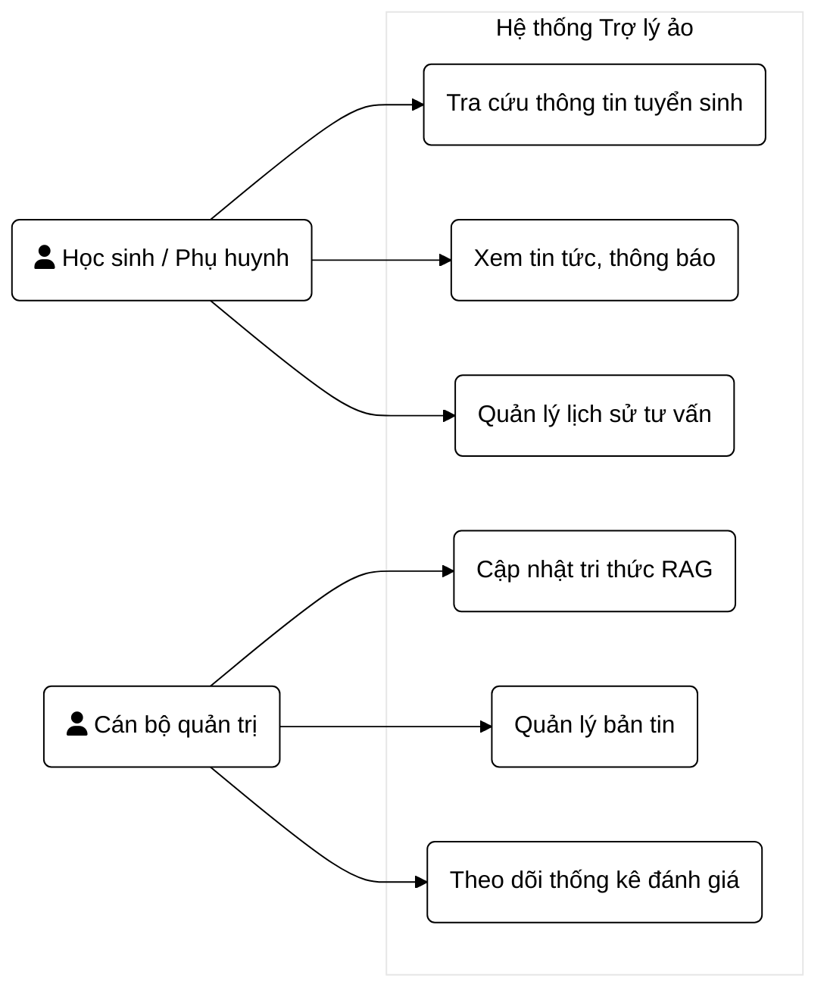
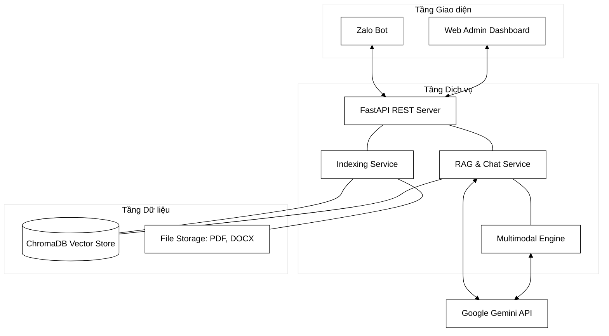
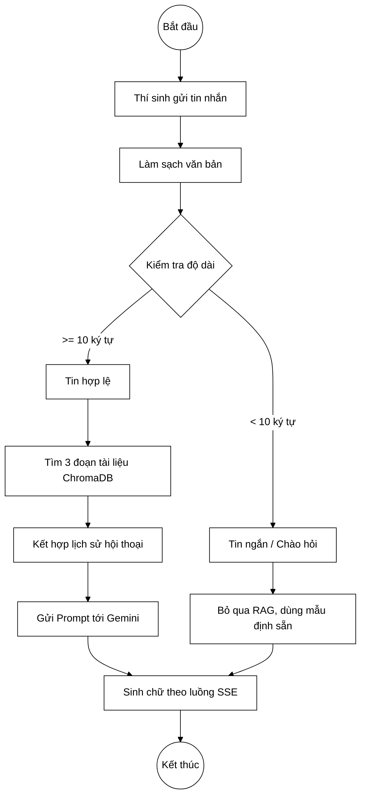
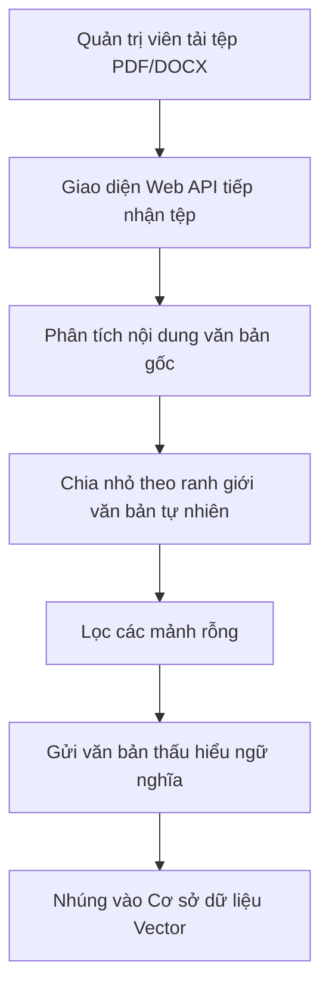
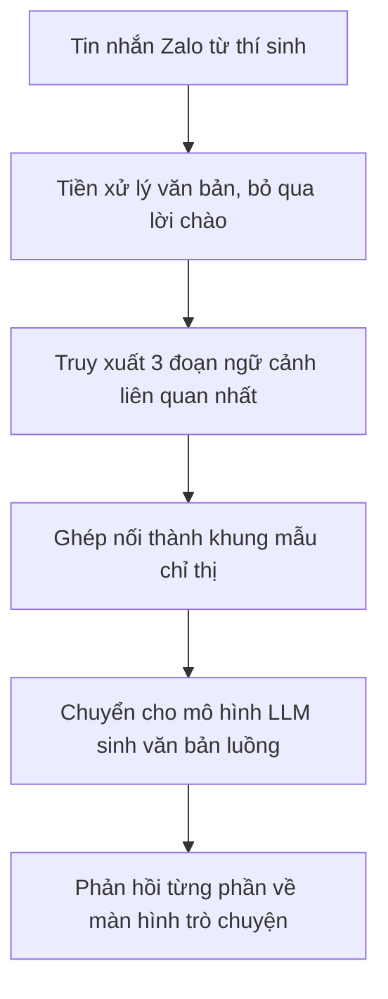
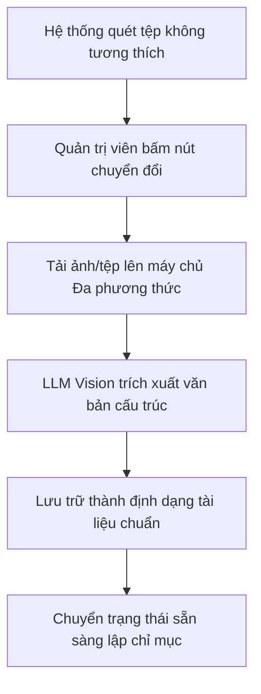
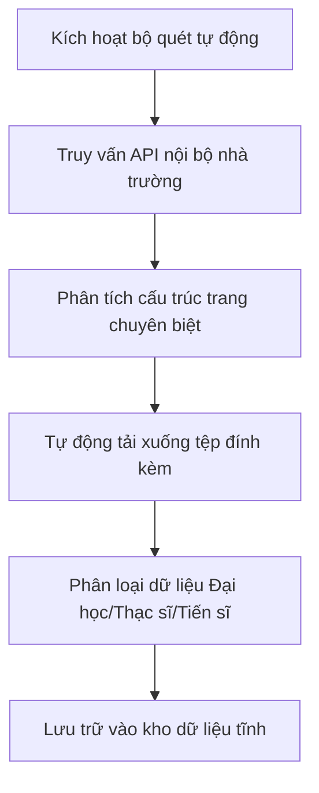

# CHƯƠNG 2: PHÂN TÍCH VÀ THIẾT KẾ HỆ THỐNG

## 2.1. Phân tích yêu cầu hệ thống

Để xây dựng một hệ thống trợ lý ảo hoạt động ổn định và đáp ứng đúng nhu cầu thực tiễn, việc xác định rõ cấu trúc tác nhân và các phân nhóm yêu cầu là bước bản lề cốt lõi. Trong hệ thống này, tồn tại hai nhóm tác nhân chính: nhóm người dùng cuối (bao gồm học sinh và phụ huynh) và nhóm quản trị viên (cán bộ tư vấn tuyển sinh).

Về yêu cầu chức năng, mỗi nhóm tác nhân đòi hỏi một bộ tính năng chuyên biệt. Đối với nhóm người dùng cuối (thí sinh và phụ huynh), hệ thống tập trung toàn bộ trải nghiệm lên nền tảng Zalo Bot, cho phép tra cứu điểm chuẩn, ngành học và quy chế tuyển sinh bằng ngôn ngữ tự nhiên một cách nhanh chóng, tiện lợi. Đối với nhóm quản trị viên, một Web Admin Dashboard chuyên biệt được xây dựng để đóng vai trò là trung tâm quản trị tri thức (hỗ trợ tải lên tài liệu, tự động phân mảnh, nhúng vector, cào dữ liệu từ trang web chính thức và chuyển đổi định dạng tệp thông qua trí tuệ nhân tạo). Quản trị viên cần công cụ giám sát toàn bộ hoạt động của hệ thống, kiểm soát kho dữ liệu vector, đồng thời theo dõi biểu đồ thống kê mức độ chính xác cũng như xu hướng câu hỏi của thí sinh.

Về yêu cầu phi chức năng, tính chính xác tuyệt đối được đặt lên hàng đầu nhằm tránh mọi rủi ro pháp lý khi cung cấp sai quy chế tuyển sinh. Hệ thống phải đảm bảo độ trễ sinh câu trả lời luôn ở mức dưới 5 giây để duy trì trải nghiệm tương tác liền mạch theo chuẩn của một ứng dụng nhắn tin theo thời gian thực. Khả năng mở rộng cũng là một tiêu chuẩn bắt buộc; kiến trúc máy chủ cần có độ chịu tải cao để đảm bảo hệ thống không bị sập nguồn khi lưu lượng truy cập từ thí sinh tăng mạnh vào những ngày công bố điểm chuẩn. Cuối cùng, tính nhất quán của cơ sở dữ liệu đòi hỏi các bản nhúng vector phải lập tức đồng bộ khi quản trị viên thực hiện thao tác xóa hoặc cập nhật quy định mới.

*Hình 2.1: Biểu đồ Use Case tổng quát của hệ thống*

## 2.2. Phân tích chuyên sâu dữ liệu tuyển sinh Trường Đại học Thủy Lợi

Nguồn dữ liệu tuyển sinh của nhà trường đóng vai trò là chất xám quyết định trực tiếp đến mức độ thông minh và độ tin cậy của toàn bộ hệ thống RAG. Thông qua quá trình khảo sát thực tế, tập dữ liệu đầu vào của đề tài được tổng hợp gồm 86 tệp tin chính thức, trải dài qua ba bậc đào tạo từ năm 2020 đến 2026.

Bảng 2.1: Thống kê nguồn dữ liệu tuyển sinh áp dụng trong hệ thống

| Bậc đào tạo | Số lượng tệp | Định dạng phổ biến | Ví dụ tiêu biểu về nội dung |
|-------------|--------------|--------------------|-----------------------------|
| **Đại học** | 38 tệp | PDF, DOCX, DOC | Đề án tuyển sinh, quyết định điểm chuẩn các năm, quy chế xét tuyển thẳng, mẫu đơn quy đổi chứng chỉ ngoại ngữ, hướng dẫn đăng ký học bạ. |
| **Thạc sĩ** | 36 tệp | PDF, DOCX | Thông báo tuyển sinh cao học, kết quả thi đầu vào, chương trình liên kết Việt-Đức, lịch học chuyển đổi, mẫu lý lịch khoa học. |
| **Tiến sĩ** | 12 tệp | PDF, DOC | Thông báo tuyển sinh nghiên cứu sinh định kỳ, các phụ lục đi kèm đề án, quy chế đào tạo tiến sĩ mới nhất. |

Trong quá trình xử lý tập dữ liệu đồ sộ này, quá trình nghiên cứu đã nhận diện được 7 thách thức đặc thù, đồng thời đề xuất các chiến lược xử lý kỹ thuật tương ứng:

1. Về vấn đề dữ liệu phân tán đa kênh và đa định dạng, thông tin thường nằm rải rác ở tệp PDF, Word cũ, và các trang HTML. Chiến lược xử lý: Xây dựng các lớp nạp dữ liệu đệ quy đa luồng, tự động nhận dạng đuôi tệp để gọi các thư viện chuyên biệt (như PyPDF, Docx2txt, và BeautifulSoup4) thực hiện bóc tách văn bản thô.
2. Đối với các bảng biểu phức tạp, điểm chuẩn thường nằm trong các bảng có hàng cột gộp chồng chéo. Các thư viện thông thường sẽ làm vỡ cấu trúc không gian của bảng. Chiến lược xử lý: Không áp dụng phương pháp đọc từng dòng, mà thiết lập thuật toán phân mảnh tôn trọng ranh giới bảng biểu, bảo toàn toàn bộ bảng vào cùng một mảnh để không cắt rời mã ngành khỏi mức điểm tương ứng.
3. Liên quan đến việc mất ngữ cảnh khi phân mảnh, một đoạn văn bản về Học phí dự kiến nếu bị cắt rời khỏi tiêu đề trang Đề án năm 2025 sẽ trở nên vô nghĩa. Chiến lược xử lý: Thuật toán phân mảnh đính kèm siêu dữ liệu tự động vào từng mảnh, nhúng năm ban hành và đối tượng áp dụng vào sâu trong định dạng dữ liệu vector.
4. Đối phó với xung đột thời gian, sự tồn tại song song của các thông báo cũ và mới có độ tương đồng ngữ nghĩa rất cao tạo ra thách thức lớn. Chiến lược xử lý: Xây dựng chế độ thêm mới với thuật toán xóa bỏ cấu trúc cũ theo nguồn phát hành; hệ thống tự động loại bỏ các đoạn vector thuộc tệp tin phiên bản cũ trước khi nạp tài liệu mới vào.
5. Về khoảng cách từ vựng, thí sinh thường dùng từ lóng, viết tắt, không dấu (ví dụ: diem cntt) khác biệt hoàn toàn với văn bản quy chế. Chiến lược xử lý: Tận dụng sức mạnh của mô hình nhúng Gemini Embedding thế hệ 2 có hỗ trợ đa ngôn ngữ, giúp tự động liên kết các biến thể ngôn ngữ tiếng Việt về cùng một tọa độ ngữ nghĩa.
6. Đối với quy tắc tuyển sinh có tính điều kiện chéo, việc xét tuyển đòi hỏi thí sinh phải thỏa mãn nhiều điều kiện ràng buộc cùng lúc (IELTS kết hợp học bạ, yêu cầu năm tốt nghiệp). Chiến lược xử lý: Thiết lập ngưỡng kích thước phân mảnh lớn (1000 ký tự) cùng độ trùm lặp cao (200 ký tự), kết hợp với kỹ thuật mở rộng ngưỡng ngữ cảnh ở phía bộ chỉ thị để LLM có thể tiếp nhận đầy đủ mệnh đề.
7. Cuối cùng, với dữ liệu ẩn trong hình ảnh, các thông tin học bổng hay lịch trình thường nằm ở dạng ảnh đồ họa. Chiến lược xử lý: Xây dựng một luồng xử lý đa phương thức, chuyển các tệp không hỗ trợ thẳng lên máy chủ Gemini Vision để trích xuất văn bản dưới dạng Markdown, sau đó chuyển đổi thành tệp DOCX tiêu chuẩn trước khi lập chỉ mục.

## 2.3. Thiết kế kiến trúc tổng thể

Giải quyết triệt để các thách thức về dữ liệu yêu cầu một kiến trúc hệ thống RAG đồng bộ và phân lớp rõ ràng. Kiến trúc tổng thể được thiết kế gồm ba tầng độc lập: Tầng Dữ liệu, Tầng Dịch vụ, và Tầng Giao diện.

*Hình 2.2: Sơ đồ kiến trúc tổng thể hệ thống 3 tầng*

Bên cạnh kiến trúc tĩnh, luồng hoạt động cốt lõi của hệ thống khi tiếp nhận một truy vấn từ người dùng được thiết kế để tối ưu hóa độ trễ và tránh lãng phí tài nguyên tính toán đối với các tin nhắn rác.

*Hình 2.3: Biểu đồ luồng hoạt động xử lý tin nhắn đầu vào*

Trong cấu trúc này, luồng vận hành được chia thành hai đường ống (pipeline) chuyên biệt hoạt động song song. 

Đường ống nạp dữ liệu đóng vai trò liên tục cập nhật kho tri thức. Khởi đầu bằng các cơ chế thu thập tự động từ website hoặc thư mục nạp thủ công, hệ thống tiền xử lý sẽ nhận diện và phân loại định dạng tệp. Với những tệp hình ảnh, quá trình chuyển đổi đa phương thức sẽ chạy ngầm để lấy văn bản. Dữ liệu văn bản thô sau đó trải qua quá trình băm nhỏ thành các đoạn tiêu chuẩn, gắn siêu dữ liệu, rồi lần lượt đi qua bộ mã hóa vector của Google trước khi được nhúng an toàn vào cơ sở dữ liệu ChromaDB. 

Đường ống truy vấn và sinh phản hồi phục vụ tương tác trực tiếp của thí sinh. Khi tin nhắn được tiếp nhận qua kênh Zalo, hệ thống trước hết làm sạch chuỗi văn bản và loại bỏ các tin nhắn dạng chào hỏi xã giao để tiết kiệm tài nguyên tìm kiếm. Với câu hỏi mang ý định tra cứu, hệ thống chuyển văn bản thành vector và truy xuất 3 đoạn tài liệu có độ tương quan cao nhất. Các đoạn tài liệu này được kết nối với câu hỏi gốc bằng một khuôn mẫu chỉ thị nghiêm ngặt. Khối văn bản lắp ghép được truyền tải luồng đến mô hình LLM, từ đó kết quả sinh ngôn ngữ sẽ chảy trực tiếp dưới dạng luồng dữ liệu liên tục về thiết bị người dùng.

## 2.4. Thiết kế kỹ thuật định hướng mô hình (Prompt Engineering)

Trái tim của độ chính xác trong hệ thống RAG không chỉ nằm ở việc tìm kiếm đúng tài liệu mà còn phụ thuộc phần lớn vào kỹ thuật định hướng mô hình (Prompt Engineering). Triết lý thiết kế chỉ thị của dự án xoay quanh 3 tiêu chuẩn cốt lõi: ưu tiên độ chính xác tuyệt đối, triệt tiêu hoàn toàn hiện tượng ảo giác, và duy trì văn phong giao tiếp tự nhiên không mang dấp dáng của máy móc.

Cấu trúc chỉ thị hệ thống (System Instruction) được cấu hình sâu trong tệp thiết lập, định hình toàn bộ tư duy của chatbot:

> Bạn là Trợ lý Tuyển sinh chính thức của Trường Đại học Thủy lợi (TLU). Nhiệm vụ của bạn là cung cấp thông tin tư vấn tuyển sinh chính xác, chuyên nghiệp và khách quan.
> QUY TẮC PHẢN HỒI:
> - TRỰC TIẾP & NGẮN GỌN: Trả lời thẳng vào trọng tâm. Tuyệt đối không chào hỏi rườm rà, không xưng hô là AI hay trợ lý ảo.
> - BÁM SÁT DỮ LIỆU: Phải dựa hoàn toàn vào "Ngữ cảnh tham khảo". Nếu thông tin không có trong ngữ cảnh, bắt buộc trả lời: "Hệ thống hiện chưa có thông tin về vấn đề này." Tuyệt đối không bịa đặt (hallucinate) hoặc sử dụng kiến thức bên ngoài.
> - VĂN PHONG TỰ NHIÊN: Không sử dụng các cụm từ lộ quy trình như "Dựa trên tài liệu".
> - XỬ LÝ GIAO TIẾP: Nếu người dùng chỉ chào hỏi hoặc tán gẫu, hãy phản hồi lịch sự bằng 1 câu duy nhất và hướng họ quay lại chủ đề tuyển sinh TLU.
> - ĐỊNH DẠNG TRỰC QUAN: Trình bày thông tin bằng danh sách gạch đầu dòng. Bắt buộc in đậm các chi tiết quan trọng.

Bộ khung chỉ thị trên sử dụng kỹ thuật cấm đoán mạnh mẽ ("Tuyệt đối không bịa đặt", "bắt buộc trả lời"). Khác với LLM thông thường cố gắng đoán câu trả lời, mô hình được ép phải "đầu hàng" và từ chối cung cấp thông tin nếu cơ sở dữ liệu vector không tìm thấy ngữ cảnh khớp. Kỹ thuật này trực tiếp nhắm vào việc giải quyết rủi ro ảo giác, đảm bảo tính pháp lý của quá trình tư vấn. Việc cấm xưng hô là "AI" và từ bỏ các cụm từ lộ quy trình máy móc giúp chatbot hòa nhập tốt hơn với tâm lý người dùng, tạo cảm giác chuyên nghiệp như một tư vấn viên con người.

Khung mẫu truy vấn (Query Template) được lắp ráp linh hoạt theo cấu trúc: `[Tiền tố ngữ cảnh] + [Các mảnh tài liệu truy xuất] + [Câu hỏi người dùng]`. Cấu trúc này tách biệt rõ ràng đâu là nguồn tri thức đáng tin cậy và đâu là chỉ thị từ người dùng, tránh tình trạng LLM bị tấn công "vượt rào" bằng các câu hỏi thao túng. Quá trình thiết lập bộ chỉ thị trải qua nhiều vòng lặp tinh chỉnh, đi từ việc chatbot nói quá nhiều, định dạng rối mắt, cho đến khi đạt được các đoạn phản hồi ngắn gọn và tập trung cao độ vào từ khóa chính.

## 2.5. Thiết kế Use Case và luồng hoạt động

Kiến trúc chức năng của hệ thống được cụ thể hóa bằng các Use Case và luồng hoạt động trực quan, chi tiết hóa từng quy trình từ lúc nạp tri thức đến khi phục vụ người dùng. Các luồng này định nghĩa toàn bộ hành vi cốt lõi của ứng dụng.

### 2.5.1. Luồng cập nhật tài liệu và tri thức
Khởi chạy khi quản trị viên cần bổ sung thông báo mới, quy trình đảm bảo văn bản đi từ dạng thô lên dạng vector tối ưu một cách hoàn toàn tự động.

### 2.5.2. Luồng tư vấn hỏi đáp đa lượt
Kích hoạt tự động khi hệ thống Zalo đẩy tin nhắn từ thí sinh về máy chủ, luồng bao hàm toàn bộ cơ chế từ đánh giá ý định, tra cứu, cho đến sinh văn bản trực tiếp.

### 2.5.3. Luồng chuyển đổi tệp đa phương thức
Xử lý các tệp hình ảnh, tệp tin cũ mà các thư viện cơ bản không thể bóc tách, ứng dụng trí tuệ nhân tạo nhận dạng để chuyển thành văn bản chuẩn.

### 2.5.4. Luồng thu thập tự động từ hệ thống lõi
Quy trình cào dữ liệu đảm bảo tin tức mới trên cổng thông tin trường học lập tức được đồng bộ hóa về hệ thống RAG mà không cần tải tệp thủ công.

## 2.6. Thiết kế giao diện và nền tảng tương tác

Tính ứng dụng của hệ thống thể hiện rõ nét qua hai mặt cắt giao diện, đáp ứng trải nghiệm cho hai nhóm đối tượng riêng biệt.

Đối với người dùng cuối, giải pháp giao diện được thiết kế tối ưu hóa hoàn toàn cho nền tảng di động thông qua Zalo Bot. Thay vì bắt buộc thí sinh phải truy cập website và tạo tài khoản phức tạp, Zalo Bot mang đến sự tiện lợi tối đa khi học sinh chỉ cần nhắn tin trực tiếp trên ứng dụng mạng xã hội quen thuộc để nhận tư vấn tức thì, giúp rút ngắn khoảng cách tiếp cận thông tin.

Ở phía quản trị viên, một Web Admin Dashboard đóng vai trò như bộ não điều hành toàn diện. Giao diện này tập trung vào phân hệ quản trị tri thức, cho phép cán bộ tuyển sinh thao tác kéo thả tài liệu trực tiếp, giám sát trạng thái lập chỉ mục, điều khiển các luồng cào dữ liệu tự động từ trang chủ nhà trường, và theo dõi biểu đồ thống kê các chỉ số vận hành. Sự phân tách rạch ròi giữa giao diện người dùng (Zalo) và giao diện quản trị (Web) giúp tối ưu hóa luồng công việc, đảm bảo tính bảo mật và sự ổn định của hệ thống trong mùa cao điểm.
