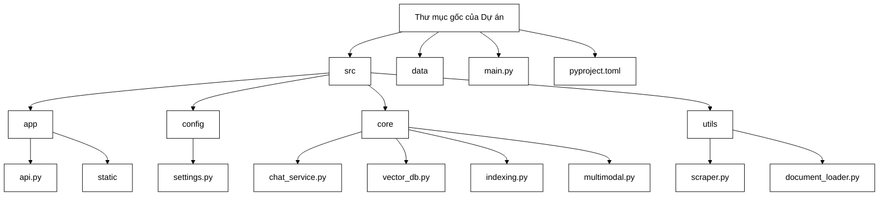
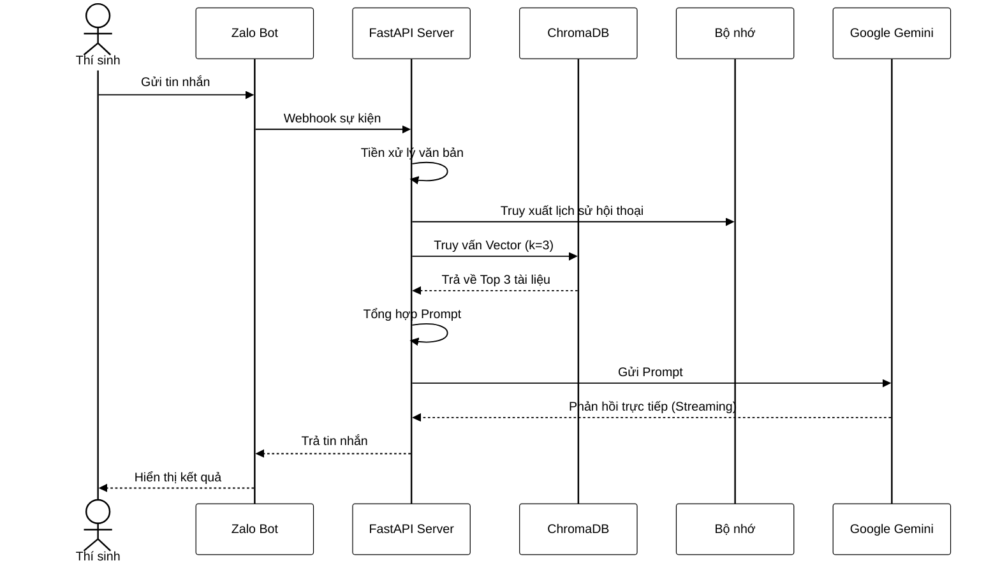

# CHƯƠNG 3: TRIỂN KHAI HỆ THỐNG

## 3.1. Thiết lập môi trường phát triển

Môi trường phát triển của dự án được thiết kế chặt chẽ theo nguyên tắc chia nhỏ thành các mô-đun độc lập, giúp mã nguồn dễ dàng bảo trì và mở rộng trong tương lai. Kiến trúc thư mục được phân bố logic từ tầng thiết lập cấu hình, các lớp nghiệp vụ cốt lõi, đến giao diện quản trị hiển thị trực quan.

*Hình 3.1: Sơ đồ cấu trúc thư mục dự án*

Để quản lý các thư viện nền tảng, hệ thống sử dụng tệp `pyproject.toml`, đảm bảo tính thống nhất về mặt phiên bản cho các công cụ trọng yếu như `google-genai` để kết nối mô hình Google, `langchain` điều phối chuỗi xử lý, `chromadb` dùng làm cơ sở dữ liệu vector, cùng `fastapi` khởi tạo hệ thống máy chủ mạng. Các lớp cấu hình linh hoạt được đặt bên trong mô-đun `settings.py` sử dụng thư viện Pydantic, giúp hệ thống kết hợp tải cấu hình tĩnh từ tệp `config.yaml` lẫn các biến môi trường bảo mật (như khóa API của Google) từ tệp `.env`. Toàn bộ văn bản mẫu dành cho bộ chỉ thị ngôn ngữ tự nhiên được cách ly hoàn toàn vào tệp `prompts.yaml`, cho phép người quản trị điều chỉnh hành vi của chatbot mà không cần phải can thiệp trực tiếp vào mã nguồn xử lý trung tâm. Điểm khởi chạy của chương trình nằm ở tệp `main.py`, thiết kế dưới dạng tập lệnh giao diện dòng lệnh, cung cấp các lệnh độc lập để khởi động hệ thống máy chủ, chạy tác vụ thu thập dữ liệu tự động, hay xây dựng lại hệ thống vector từ đầu.

## 3.2. Triển khai mô-đun thu thập dữ liệu

Quá trình làm giàu kho tri thức bắt nguồn từ mô-đun thu thập đa nguồn, tích hợp các cơ chế tự động từ trang thông tin điện tử lẫn cơ chế trích xuất dữ liệu từ các định dạng tệp phức tạp.

Khối thu thập dữ liệu tự động được định nghĩa tại lớp `TLUAdmissionScraper`. Thuật toán trực tiếp kết nối với giao diện lập trình nội bộ của nhà trường để tải danh sách các bài báo theo ba nhóm cấu hình chính: Đại học, Thạc sĩ, và Tiến sĩ. Quy trình hoạt động truy vấn từng danh sách bài báo, đi sâu vào tải nội dung HTML chi tiết, sau đó sử dụng thư viện `BeautifulSoup` để loại bỏ rác mã lệnh và rà quét mọi liên kết trỏ đến các tệp dữ liệu tuyển sinh. Để tăng tốc độ xử lý khi phải duyệt qua hàng trăm bài báo, hệ thống lập trình lớp xử lý đa luồng với công cụ `ThreadPoolExecutor`, cho phép 5 luồng tải tệp diễn ra song song và tự động hóa toàn bộ quá trình phân loại, lưu trữ vào cấu trúc thư mục quy định.

Khối xử lý tập tin lưu trữ được đảm nhiệm bởi hệ thống quét đệ quy tại thư mục chứa tri thức. Cơ chế nhận diện tự động đánh giá phần mở rộng của từng tệp tin và điều hướng chúng đến công cụ trích xuất văn bản tương ứng. Đối với tài liệu định dạng PDF phổ biến, lớp `PyPDFLoader` sẽ quét cấu trúc tài liệu. Riêng đối với định dạng văn bản DOCX, lớp `Docx2txtLoader` được triển khai để bảo toàn độ chính xác của các đoạn ký tự. 

Điểm nổi bật ở tầng này là bộ chuyển đổi tệp đa phương thức, giải quyết các tệp hình ảnh không tương thích hệ thống phân mảnh thông thường. Quá trình bắt đầu khi hệ thống tải tệp không hỗ trợ trực tiếp lên nền tảng đám mây của Gemini. Một bộ chỉ thị chuyên biệt yêu cầu mô hình thị giác máy tính đọc toàn bộ thông tin ảnh và trả về dưới cấu trúc văn bản Markdown chuẩn hóa, trước khi mã nguồn Python tổng hợp lại và ghi thành tệp định dạng DOCX chuẩn bị cho quá trình lập chỉ mục ở khâu tiếp theo.

## 3.3. Triển khai mô-đun xử lý và lưu trữ vector

Mô-đun lưu trữ vector gánh vác trách nhiệm dịch ngôn ngữ tự nhiên sang dạng số học để phục vụ bài toán truy xuất siêu tốc. Các xử lý mã hóa cốt lõi được cấu trúc sâu vào lớp `VectorDBManager` và lớp `GeminiEmbeddings`.

Hệ thống mã hóa kế thừa giao diện tiêu chuẩn của LangChain, bọc gọn giao tiếp với API `google.genai`. Tại đây, quá trình chuyển tải văn bản không diễn ra đơn lẻ mà được gom lô, xử lý 100 đoạn văn bản cùng một lúc nhằm tối ưu hóa giới hạn băng thông truy vấn máy chủ. Thuật toán tinh tế phân biệt rõ ràng hai dạng tác vụ nhúng vector với thuộc tính cấu hình `task_type`: khi mã hóa dữ liệu văn bản dùng `retrieval_document`, và khi mã hóa câu hỏi người dùng dùng `retrieval_query`. Đồng thời, các trường hợp viền như mảnh văn bản rỗng, danh sách hay định dạng đối tượng đều được viết mã làm sạch kỹ lưỡng để tránh gây ra lỗi sập quá trình mã hóa đồng loạt.

Giai đoạn quản trị cơ sở dữ liệu xây dựng trực tiếp hệ thống ChromaDB cục bộ. Khâu phân mảnh tài liệu sử dụng lớp `RecursiveCharacterTextSplitter`, phân tách với ngưỡng độ dài cố định 1000 ký tự và độ trùm lặp 200 ký tự để không bẻ gãy cấu trúc ngữ nghĩa dài dòng. Điểm nhấn kỹ thuật nằm ở chế độ chèn nối. Để giải quyết xung đột khi thêm văn bản mới, máy chủ không xóa toàn bộ cơ sở dữ liệu. Thay vào đó, thuật toán truy vấn danh sách siêu dữ liệu nguồn của các văn bản đang cập nhật, yêu cầu hệ quản trị vector xóa toàn bộ các khối ký tự cũ có cùng nguồn phát hành trước khi nhúng loạt dữ liệu mới vào, triệt tiêu hoàn toàn sự cố trùng lặp tri thức. 

Lớp nghiệp vụ `IndexingService` đóng vai trò nhạc trưởng điều phối toàn bộ chu trình mã hóa này. Dịch vụ duy trì tính đồng nhất giữa hệ thống tệp lưu trữ và trạng thái của cơ sở dữ liệu, ghi nhận trạng thái phân bổ gồm tệp đã lập chỉ mục (✅ Indexed), tệp đang chờ (⏳ Pending), và tệp bị mất kết nối thực tế (⚠️ Missing Local).

## 3.4. Triển khai mô-đun hỏi đáp RAG

Sự tương tác cuối cùng của toàn bộ cấu trúc dữ liệu được hiện thực hóa tại mô-đun hỏi đáp RAG, quản lý mọi luồng đối thoại giữa học sinh và sức mạnh của ngôn ngữ trí tuệ nhân tạo.

Tại lớp giao tiếp lõi `MultimodalEngine`, hệ thống điều khiển API thế hệ mới của Google vận hành ở chế độ nhiệt độ cực thấp (`temperature=0.0`) nhằm cung cấp đầu ra tất định, hạn chế tình trạng sinh ngôn ngữ hoa mỹ xa rời sự thật. Khi tiếp nhận tệp đính kèm đa phương thức, hệ thống tích hợp vòng lặp chờ trạng thái tệp (`PROCESSING` sang `ACTIVE`) trên máy chủ Google để tránh lỗi mất đồng bộ. Quá trình sinh phản hồi hoạt động dưới chế độ luồng tuần tự (`generate_content_stream`), kết hợp logic tự động thử lại khi máy chủ trả về mã lỗi 429 quá tải băng thông (buộc chờ 30 giây với tối đa 3 lần thử), đảm bảo tính kiên cường trong môi trường truy cập mật độ cao.

Hàm nghiệp vụ `chat_response` điều khiển luồng RAG đầu cuối. Luồng vào của dữ liệu sẽ được bộ làm sạch văn bản tiền xử lý, kiểm tra nhanh nếu câu hỏi người dùng chỉ có nội dung chào hỏi ngắn gọn (như "chào", "hi") hay dưới 10 ký tự, hệ thống lập tức bỏ qua khâu tìm kiếm tệp vector đắt đỏ. Đối với câu hỏi bình thường, hàm tra cứu kích hoạt thuật toán tìm kiếm tương đồng trên cấu trúc cơ sở dữ liệu ChromaDB, trích xuất giới hạn đúng 3 đoạn tài liệu (`k=3`) có độ liên quan cao nhất. Điểm nhấn trong luồng hội thoại là việc tích hợp bộ nhớ ngữ cảnh `ConversationBufferMemory` của LangChain. Bộ nhớ này có nhiệm vụ lưu trữ lịch sử cuộc trò chuyện, giúp hệ thống liên kết các câu hỏi liền kề và duy trì mạch đối thoại tự nhiên, đặc biệt trong trường hợp thí sinh ngắt nhỏ câu hỏi. Bằng cách gộp đoạn tiền tố thông tin, các mảnh tài liệu truy xuất, lịch sử hội thoại từ bộ nhớ, và mẫu chỉ thị cố định, máy chủ đưa khung truy vấn hoàn chỉnh đến mô hình ngôn ngữ và trả về trực tiếp từng phân đoạn chữ sinh ra từ AI về tay người dùng.

*Hình 3.2: Biểu đồ tuần tự luồng hỏi đáp RAG*

## 3.5. Triển khai API Backend (FastAPI)

Tất cả các dịch vụ tính toán và xử lý của hệ thống đều được kết nối với môi trường internet thông qua hạ tầng máy chủ hiệu năng cao FastAPI, quản lý luồng dữ liệu hai chiều.

Kiến trúc API REST được thiết kế tách biệt và tối giản. Tuyến API lõi phục vụ tư vấn (`POST /api/chat`) tích hợp kết xuất trực tiếp dạng chuỗi sự kiện tự chuyển (SSE), giúp tạo nên hiệu ứng trò chuyện thời gian thực. Toàn bộ các tuyến liên quan đến vận hành quản trị được quy hoạch về cấu trúc định tuyến độc lập, bao gồm các dịch vụ giám sát thông số hệ thống (`GET /api/admin/stats`), dịch vụ truy xuất danh sách tập tin (`GET /api/admin/files`), các tác vụ tái lập chỉ mục đồng loạt hoặc tải lên tập tin riêng lẻ (`POST /api/admin/index/*`). Ngoài ra, máy chủ cấu hình mở rộng kết nối thông qua Middleware CORS, đảm bảo các ứng dụng giao diện hoạt động từ nền tảng miền khác nhau vẫn có thể tương tác không rào cản. Tích hợp máy chủ cùng Zalo Bot hoạt động trên nền tảng webhook, tiếp nhận sự kiện tín hiệu mỗi khi người dùng gõ phím và gọi hàm trả luồng câu trả lời thông minh. Toàn bộ khối tĩnh chứa giao diện điều khiển (HTML, CSS) được khai báo phục vụ trực tiếp ngay trên cổng nội bộ thông qua cơ chế tĩnh hóa tệp tin của phần mềm.

## 3.6. Triển khai giao diện Web Admin

Dù ẩn sau hậu trường, giao diện bảng điều khiển nền tảng Web đóng góp nền tảng tương tác thiết yếu cho ban cố vấn kỹ thuật của nhà trường.

Với chiến lược xây dựng bố cục rõ ràng, giao diện đặt trung tâm vào danh sách các tập tin biểu thị dưới dạng bảng kết hợp bộ mã màu cảnh báo trực quan cho trạng thái dữ liệu. Nền tảng cho phép người quản lý thao tác kéo thả tệp tin nhanh gọn, tích hợp cơ chế liên kết ngay lập tức với hệ thống máy chủ FastAPI phía sau để lập tức băm nhỏ văn bản theo thời gian thực. Khu vực chức năng cung cấp hàng loạt nút bấm tác vụ nhanh: quét tự động dữ liệu mới trên trang chủ, xây dựng lại toàn bộ kho tri thức, hoặc kích hoạt mô hình chuyển đổi ảnh thành văn bản thông minh. Số liệu hệ thống được đồng bộ qua bảng tóm tắt, giúp nhà trường liên tục cập nhật khả năng thấu hiểu của chatbot dựa trên số lượng mảnh ký tự mà cơ sở dữ liệu vector đã nắm giữ. Sự liên kết mượt mà của giao diện quản trị giúp ban vận hành tự động hóa mọi hoạt động cập nhật tuyển sinh mà không yêu cầu kiến thức kỹ thuật phức tạp.
