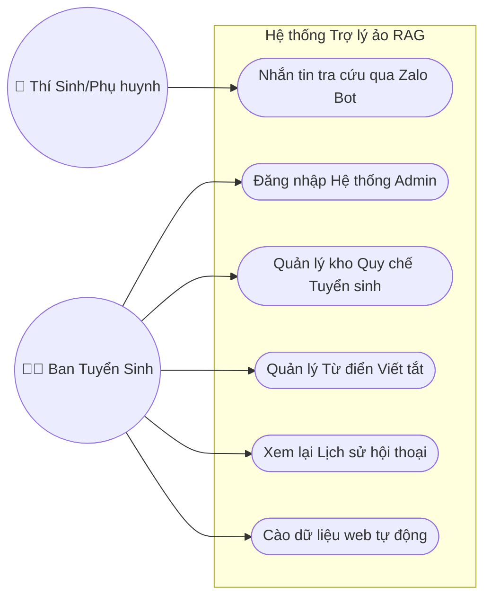
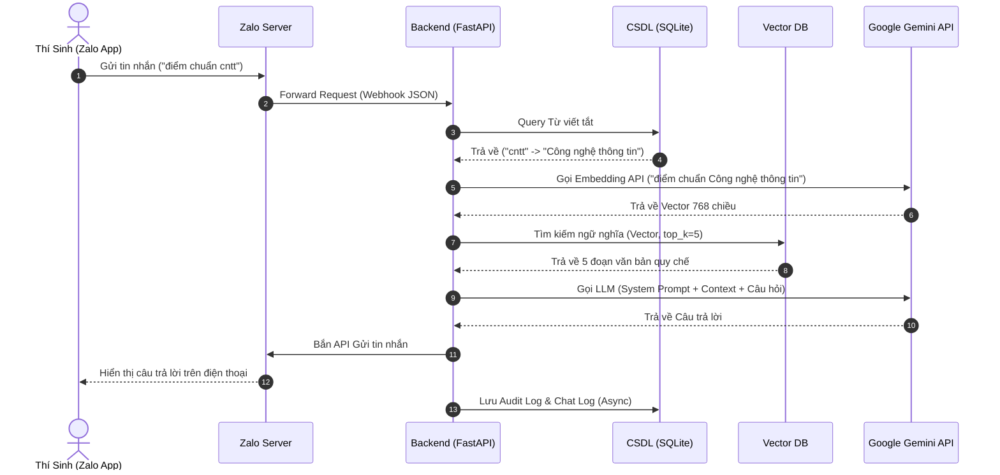
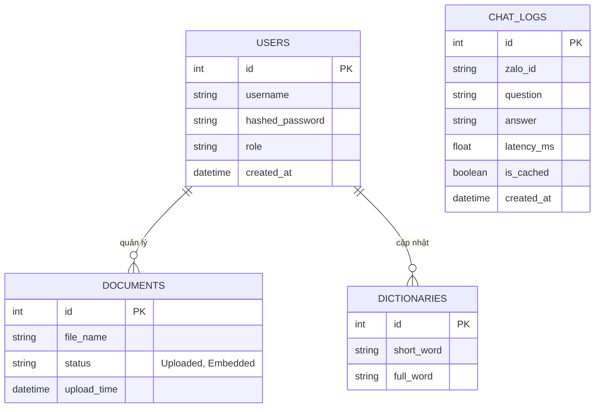

# TỔNG HỢP CÁC BIỂU ĐỒ UML SẴN SÀNG ĐỂ COPY

Bạn có thể copy các khối code dưới đây và dán vào [https://mermaid.live/](https://mermaid.live/) để xuất ra file ảnh (PNG/SVG) chất lượng cao và dán vào Slide hoặc Báo cáo.

## 1. Sơ đồ Use Case Tổng Quát


## 2. Biểu đồ Hoạt động (Activity Diagram) - Luồng Chatbot
```mermaid
flowchart TD
    Start([Bắt đầu]) --> Nhận[Nhận câu hỏi từ Zalo]
    Nhận --> Filter[Tiền xử lý: Dịch từ viết tắt qua SQLite]
    Filter --> Rule{Intent hợp lệ?}
    
    Rule -- Sai (Câu hỏi ngoài luồng) --> Reject[Từ chối trả lời] --> B[Gửi tin nhắn về Zalo] --> End([Kết thúc])
    
    Rule -- Đúng --> Embed[Mã hóa Vector câu hỏi (Gemini Embedding)]
    Embed --> Cache{Kiểm tra Semantic Cache
Độ tương đồng > 95%?}
    
    Cache -- Có (Trúng đệm) --> Hit[Lấy câu trả lời sẵn từ Cache] --> B
    
    Cache -- Không (Trượt đệm) --> DB[Tìm Top 5 Context trong ChromaDB]
    DB --> LLM[Gửi Context + Câu hỏi cho Gemini LLM]
    LLM --> Sinh[Gemini sinh câu trả lời]
    Sinh --> Save[Lưu kết quả vào Cache & SQLite ChatLogs]
    Save --> B
```

## 3. Biểu đồ Tuần tự (Sequence Diagram) - RAG Streaming


## 4. Mô hình Cơ sở dữ liệu (ERD)

