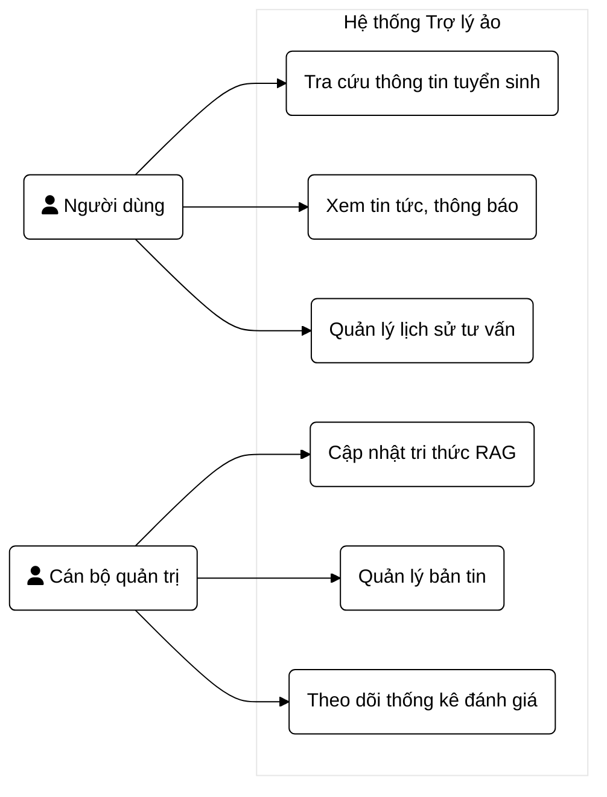
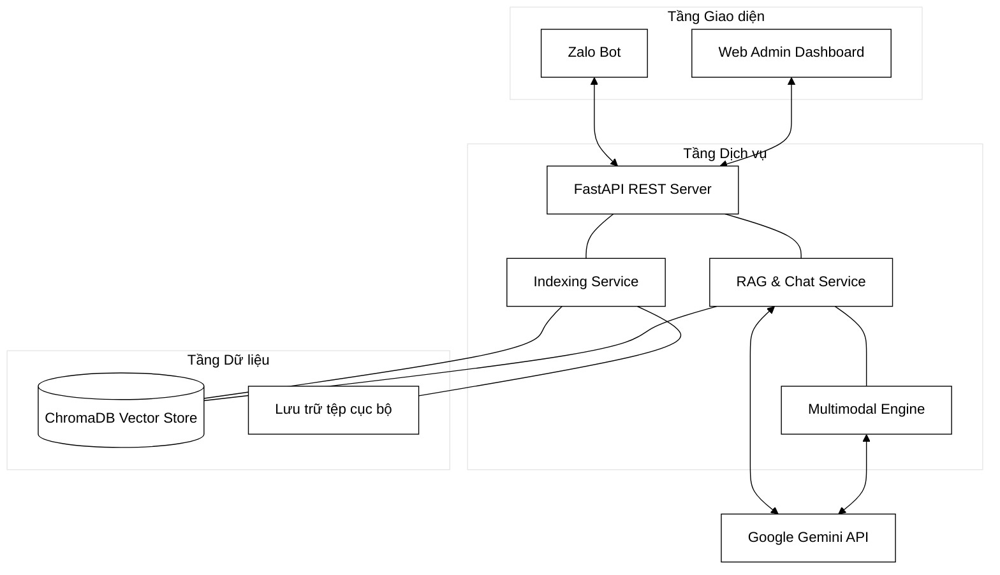
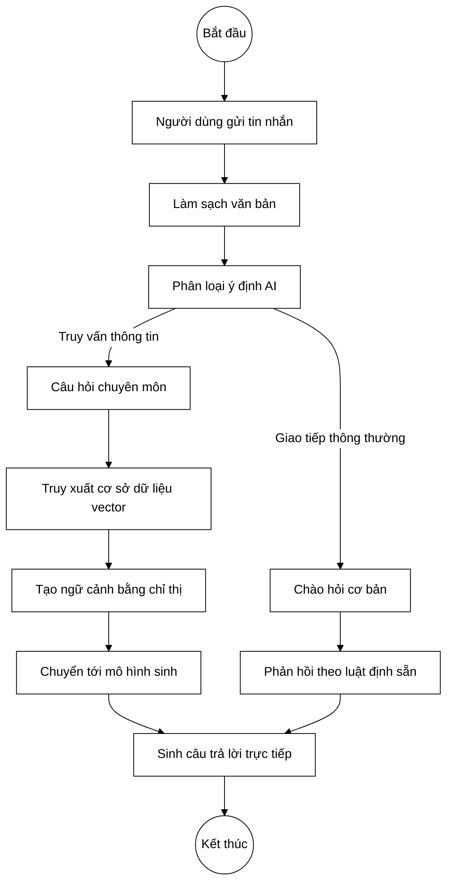
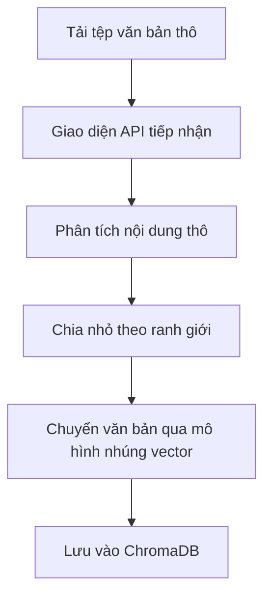
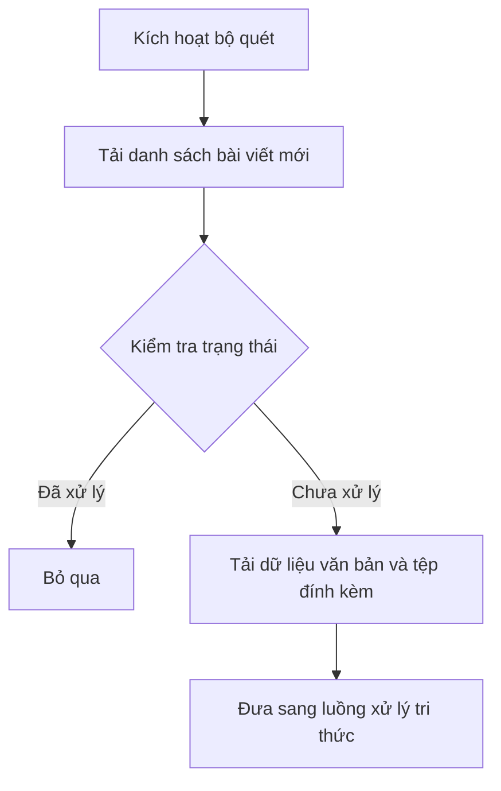
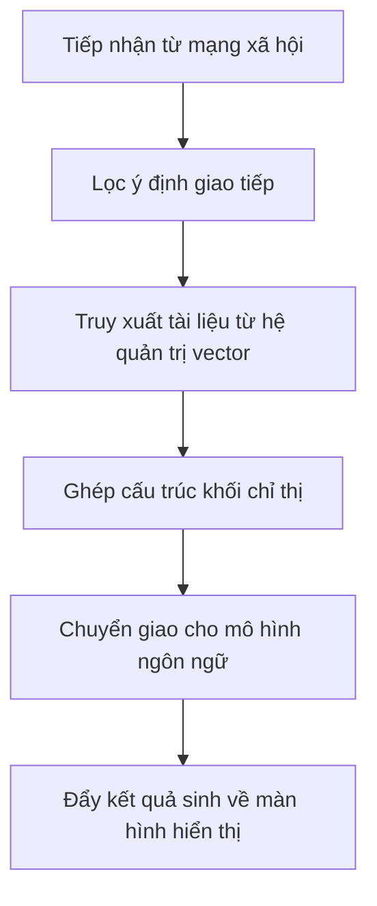
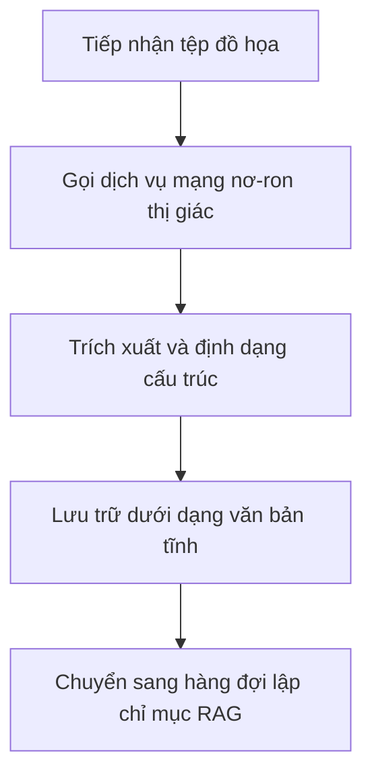

# CHƯƠNG 2: PHÂN TÍCH VÀ THIẾT KẾ HỆ THỐNG

## 2.1. Phân tích yêu cầu hệ thống

Hệ thống được thiết kế hướng tới hai nhóm người dùng độc lập: học sinh, phụ huynh và đội ngũ quản trị viên tuyển sinh. Yêu cầu chức năng phân tách rõ rệt theo mục đích sử dụng của từng nhóm.

Nhóm người dùng cuối tiếp cận hệ thống qua Zalo Bot để tra cứu điểm chuẩn, quy chế và thông tin ngành học bằng ngôn ngữ tự nhiên. 

Nhóm quản trị viên thao tác trên Web Admin Dashboard để cập nhật cơ sở tri thức, bao gồm chức năng nạp tệp tài liệu, kiểm soát quá trình phân mảnh và nhúng vector. Giao diện này cung cấp các công cụ cào dữ liệu tự động, trích xuất văn bản từ hình ảnh và giám sát lịch sử truy vấn.

Về yêu cầu phi chức năng, hệ thống hướng tới việc tối ưu hóa độ chính xác đối với thông tin trích xuất từ quy chế. Độ trễ phản hồi được giới hạn dưới 5 giây nhằm duy trì sự liền mạch trong hội thoại. Kiến trúc máy chủ cần có khả năng xử lý bất đồng bộ để đáp ứng lượng lớn yêu cầu đồng thời trong thời kỳ cao điểm tuyển sinh.

*Hình 2.1: Biểu đồ Use Case tổng quát của hệ thống*

## 2.2. Phân tích chuyên sâu dữ liệu tuyển sinh Trường Đại học Thủy Lợi

Nguồn dữ liệu tuyển sinh đóng vai trò nền tảng, trực tiếp quyết định độ tin cậy của mô hình RAG. Tập dữ liệu đầu vào gồm 86 tệp quy chế chính thức, phân bổ ở ba bậc đào tạo giai đoạn 2020 đến 2026.

| Bậc đào tạo | Số lượng tệp | Định dạng phổ biến | Ví dụ tiêu biểu về nội dung |
|-------------|--------------|--------------------|-----------------------------|
| Đại học | 38 tệp | PDF, DOCX, DOC | Đề án tuyển sinh, điểm chuẩn, quy chế xét tuyển thẳng, mẫu quy đổi ngoại ngữ. |
| Thạc sĩ | 36 tệp | PDF, DOCX | Thông báo tuyển sinh cao học, kết quả đầu vào, lịch học, mẫu lý lịch khoa học. |
| Tiến sĩ | 12 tệp | PDF, DOC | Thông báo định kỳ, phụ lục đề án, quy chế đào tạo tiến sĩ mới nhất. |

*Bảng 2.1: Thống kê nguồn dữ liệu tuyển sinh áp dụng trong hệ thống*

Dữ liệu tuyển sinh phân tán trên nhiều định dạng đặt ra bài toán về tính đồng nhất. Hệ thống tích hợp các luồng nạp tự động, định tuyến đuôi tệp đến đúng thư viện xử lý tương ứng như PyPDF hoặc BeautifulSoup4.

Vấn đề cấu trúc bảng biểu, đặc biệt là bảng điểm chuẩn chứa các ô gộp hàng và cột, được xử lý bằng thuật toán phân mảnh bảo toàn ranh giới. Kỹ thuật này giữ nguyên định dạng hàng ngang thay vì phá vỡ cấu trúc theo từng dòng văn bản đơn lẻ, đảm bảo điểm số luôn gắn liền với mã ngành tương ứng.

Để tránh tình trạng mất ngữ cảnh khi văn bản bị phân rã, siêu dữ liệu được trích xuất tự động qua việc phân tích cây cấu trúc phân cấp nguyên thủy của định dạng DOCX thay vì dùng biểu thức chính quy thô sơ. Thuật toán nhận diện cấu trúc tiêu đề (Heading 1, Heading 2) để đính kèm tên chương, điều, khoản gốc vào từng vector con. Cơ chế này đóng vai trò mấu chốt giúp hệ thống định vị và ghi đè các vector cũ khi có quy chế mới cập nhật.

Người dùng thường nhắn tin bằng ngôn ngữ không dấu hoặc viết tắt. Ứng dụng mô hình nhúng thế hệ mới giúp chuyển đổi hiệu quả các biến thể ngôn ngữ tự do này về cùng tọa độ không gian ngữ nghĩa với văn phong hành chính tiêu chuẩn.

Quy chế tuyển sinh thường chứa mệnh đề logic phức tạp. Phân tích thống kê trên 86 tài liệu cho thấy độ dài trung bình của một điều khoản là 680 ký tự. Kết quả này được trích xuất từ mã nguồn Python phân tích cú pháp 42.000 từ, cho thấy hàm mật độ xác suất tuân theo phân phối Log-Normal lệch phải. Do đó, kích thước phân mảnh 1000 ký tự được cấu hình để bao phủ 95% lượng điều khoản mà không làm đứt gãy câu, kèm theo độ trùm lặp 200 ký tự để duy trì mạch văn. Hệ thống thiết lập truy xuất đồng thời 3 đoạn tài liệu có độ tương quan cao nhất, đảm bảo mô hình LLM có đủ dữ liệu tham chiếu đa chiều.

Các tệp đồ họa dạng ảnh được định tuyến qua luồng xử lý đa phương thức. Kiến trúc sử dụng thư viện OpenCV để lọc nhiễu và định vị đường viền bảng, kết hợp mô hình PaddleOCR chuyên dụng để phát hiện hộp văn bản (text detection) và trích xuất ký tự, sau đó tái cấu trúc thành định dạng Markdown tiêu chuẩn trước khi đưa vào hàng đợi lập chỉ mục.

## 2.3. Thiết kế kiến trúc tổng thể

Kiến trúc hệ thống RAG được thiết kế gồm ba tầng độc lập: Tầng Dữ liệu, Tầng Dịch vụ và Tầng Giao diện.

*Hình 2.2: Sơ đồ kiến trúc tổng thể hệ thống*

Luồng hoạt động xử lý truy vấn đầu vào được thiết lập nhằm phân loại nhanh ý định và tối ưu tài nguyên.

*Hình 2.3: Biểu đồ xử lý tin nhắn*

Hệ thống vận hành qua hai luồng song song. Luồng nạp tri thức định kỳ thu thập tài liệu, phân rã và nhúng thông tin vào ChromaDB. Luồng truy vấn tiếp nhận dữ liệu từ Zalo, sử dụng mô hình phân loại ý định để định tuyến câu hỏi, mã hóa vector và truyền tải văn bản đã được tổng hợp dạng chuỗi sự kiện liên tục.

## 2.4. Thiết kế kỹ thuật định hướng mô hình

Thiết kế chỉ thị cho LLM tập trung vào ba yêu cầu cốt lõi: tính chính xác, chống ảo giác và văn phong giao tiếp tự nhiên. 

Cấu trúc prompt được thiết lập tại lớp điều phối trung tâm:

> Bạn là Trợ lý Tuyển sinh chính thức của Trường Đại học Thủy lợi. Nhiệm vụ của bạn là cung cấp thông tin tư vấn chính xác và khách quan.
> QUY TẮC PHẢN HỒI:
> - TRỰC TIẾP & NGẮN GỌN: Trả lời đúng trọng tâm câu hỏi.
> - BÁM SÁT DỮ LIỆU: Phản hồi dựa hoàn toàn vào ngữ cảnh tham khảo được cung cấp. Nếu thông tin không tồn tại, bắt buộc thông báo hệ thống chưa có dữ liệu. Không sử dụng suy diễn bên ngoài.
> - VĂN PHONG TỰ NHIÊN: Không liệt kê cấu trúc truy xuất dữ liệu trong nội dung câu trả lời. Trình bày thông tin dạng danh sách gọn gàng.

Luật cấm đoán nghiêm ngặt ép mô hình từ chối cung cấp dữ liệu nếu hệ thống truy xuất không trả về kết quả liên quan. Khung chỉ thị lắp ráp ngữ cảnh và câu hỏi người dùng thành các khối riêng biệt, ngăn chặn kịch bản tấn công làm sai lệch chức năng trợ lý ảo.

## 2.5. Thiết kế Use Case và luồng hoạt động

### 2.5.1. Luồng cập nhật tài liệu và tri thức

Quy trình tự động hóa thao tác chuyển đổi tài liệu mới thành cơ sở dữ liệu vector.

### 2.5.2. Luồng thu thập dữ liệu tự động từ trang chủ

Cơ chế quét bài viết trên cổng thông tin đảm bảo tính liền mạch trong khâu cập nhật quy chế.

### 2.5.3. Luồng tư vấn hỏi đáp đa lượt

Chu trình hoạt động lõi xử lý câu hỏi từ người dùng thông qua mạng xã hội.

### 2.5.4. Luồng xử lý đa phương thức

Phương thức bóc tách văn bản phức tạp nằm trong hình ảnh thông qua mô hình thị giác.

## 2.6. Thiết kế giao diện và nền tảng tương tác

Người dùng tương tác thông qua nền tảng Zalo Bot. Việc triển khai trực tiếp trên ứng dụng nhắn tin loại bỏ rào cản tải phần mềm, giúp quá trình tra cứu thông tin diễn ra mượt mà từ thiết bị di động cá nhân.

Bộ phận quản trị sử dụng Web Admin Dashboard để điều hành phân hệ nền tảng. Giao diện trực quan cho phép theo dõi quá trình phân rã dữ liệu, thiết lập bộ quét thông tin tự động và thống kê chỉ số máy chủ. Phân tách rạch ròi giữa kênh nhắn tin và kênh điều hành giúp tối ưu tài nguyên tính toán.
