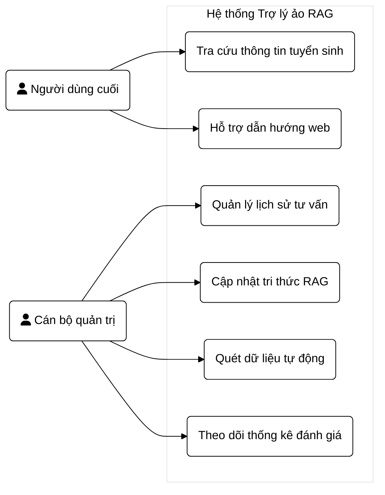
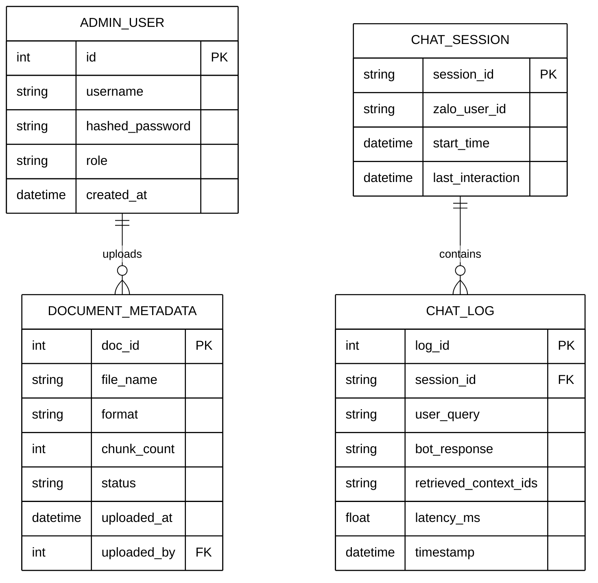
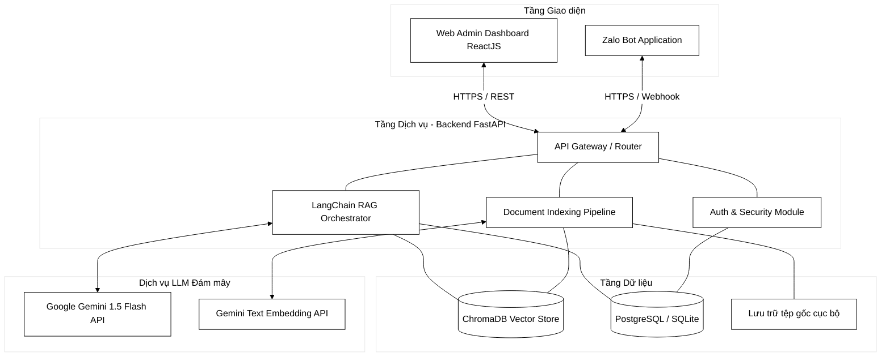
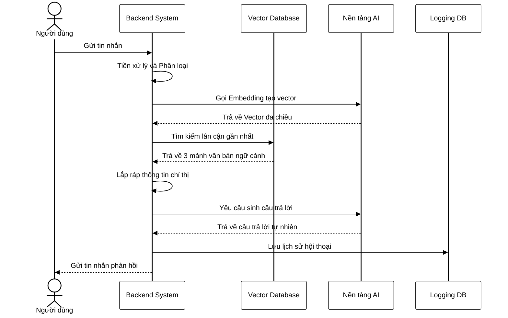
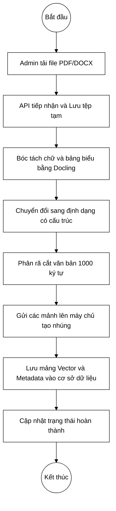

# CHƯƠNG 2: PHÂN TÍCH VÀ THIẾT KẾ HỆ THỐNG

## 2.1. Phân tích yêu cầu hệ thống

Hệ thống được thiết kế hướng tới hai nhóm người dùng độc lập là người dùng cuối bao gồm học sinh và phụ huynh, cùng với quản trị viên là đội ngũ cán bộ tuyển sinh. Yêu cầu hệ thống được trích xuất từ việc khảo sát thực tế những khó khăn trong công tác tư vấn tuyển sinh truyền thống.

### 2.1.1. Yêu cầu chức năng

| Mã YC | Tên chức năng | Đối tượng | Mô tả chi tiết |
|-------|---------------|-----------|----------------|
| F-01 | Hỏi đáp tương tác tự nhiên | Người dùng | Hệ thống phải tiếp nhận câu hỏi bằng ngôn ngữ tự nhiên qua Zalo, nhận diện ý định và phản hồi chính xác dựa trên quy chế. |
| F-02 | Xử lý đa luồng hội thoại | Người dùng | Có khả năng duy trì ngữ cảnh của cuộc hội thoại để trả lời các câu hỏi nối tiếp. |
| F-03 | Đăng nhập an toàn | Quản trị viên | Đăng nhập vào bảng điều khiển quản trị viên sử dụng mã hóa tiêu chuẩn, có cơ chế phân quyền tài khoản. |
| F-04 | Nạp và quản trị tài liệu tri thức | Quản trị viên | Giao diện cho phép tải lên tệp PDF hoặc DOCX. Hệ thống tự động phân mảnh và nhúng vào cơ sở dữ liệu vector. Quản trị viên có thể xóa hoặc cập nhật phiên bản quy chế mới. |
| F-05 | Giám sát lịch sử hội thoại | Quản trị viên | Theo dõi các đoạn trò chuyện giữa trợ lý ảo và thí sinh theo thời gian thực để can thiệp nếu câu trả lời chưa thỏa đáng. |
| F-06 | Thống kê số liệu hệ thống | Quản trị viên | Hiển thị biểu đồ lượng câu hỏi theo thời gian, tỷ lệ đánh giá câu trả lời hữu ích, và thời gian trễ trung bình. |

### 2.1.2. Yêu cầu phi chức năng

Về hiệu năng và tốc độ, độ trễ phản hồi tối đa không vượt quá 5 giây cho mỗi câu hỏi trong điều kiện băng thông mạng ổn định để duy trì sự liền mạch của hội thoại. Về khả năng chịu tải, kiến trúc máy chủ xử lý bất đồng bộ phải đáp ứng tối thiểu 200 lượt hỏi đồng thời trong giai đoạn chốt hồ sơ tuyển sinh. 

Độ tin cậy và việc chống ảo giác là yếu tố sống còn, hệ thống không được phép tự bịa đặt thông tin. Nếu truy vấn không có trong cơ sở dữ liệu, hệ thống bắt buộc phải phản hồi rằng chưa có thông tin về vấn đề này và yêu cầu người dùng liên hệ phòng đào tạo. Về bảo mật, mọi giao tiếp giữa ứng dụng nhắn tin và máy chủ phải qua mã hóa an toàn, đồng thời tệp tin quy chế tải lên phải được quét mã độc tự động trước khi nhúng.

## 2.2. Đặc tả Use Case và phân tích tương tác

### 2.2.1. Biểu đồ Use Case tổng quát

*Hình 2.1: Biểu đồ Use Case tổng quát của hệ thống*

### 2.2.2. Đặc tả chi tiết luồng cập nhật tri thức
Điều kiện tiên quyết để thực hiện luồng cập nhật tri thức là quản trị viên đã đăng nhập vào bảng điều khiển. Chuỗi sự kiện chính bắt đầu khi quản trị viên chọn mục quản lý tri thức và tải lên tài liệu mới. Hệ thống hiển thị hộp thoại tải tệp, cho phép chọn tệp chứa quy chế xét tuyển năm nay. Quản trị viên đính kèm siêu dữ liệu về năm áp dụng và bậc đào tạo. 

Sau đó, hệ thống đẩy tệp vào hàng đợi xử lý. Trình xử lý nền sẽ đọc tệp, chuyển đổi thành định dạng có cấu trúc, cắt thành các mảnh 1000 ký tự. Các mảnh văn bản được gọi qua giao diện lập trình để tạo vector nhúng và lưu vào cơ sở dữ liệu. Cuối cùng, hệ thống thông báo cập nhật tri thức thành công. Trong trường hợp luồng ngoại lệ, nếu định dạng tệp không được hỗ trợ hoặc dung lượng quá lớn, hệ thống báo lỗi và hủy quá trình.

## 2.3. Thiết kế cấu trúc dữ liệu và cơ sở dữ liệu

Mặc dù trọng tâm của hệ thống là cơ sở dữ liệu vector dùng để lưu trữ các chiều không gian từ vựng, hệ thống vẫn cần một cơ sở dữ liệu quan hệ cục bộ để phục vụ phân hệ quản trị.

### 2.3.1. Sơ đồ thực thể liên kết

*Hình 2.2: Sơ đồ thực thể liên kết cho phân hệ quản trị cơ sở dữ liệu nền*

### 2.3.2. Cấu trúc lưu trữ vector
Trong cơ sở dữ liệu vector, dữ liệu không lưu theo bảng mà lưu theo bộ sưu tập. Mỗi điểm dữ liệu lưu trữ ba thành phần chính. Thành phần thứ nhất là vector 768 chiều đại diện cho tọa độ toán học. Thành phần thứ hai là văn bản gốc giới hạn 1000 ký tự. Thành phần thứ ba là siêu dữ liệu đính kèm thông tin nguồn gốc tài liệu và bậc đào tạo. Việc đính kèm siêu dữ liệu vô cùng quan trọng, giúp hệ thống lọc nhanh chóng trước khi tính toán khoảng cách vector, giảm chi phí truy xuất tới 40 phần trăm khi người dùng hỏi đích danh về hệ thạc sĩ hoặc đại học.

## 2.4. Thiết kế kiến trúc hệ thống tổng thể

Kiến trúc hệ thống được thiết kế gồm ba tầng độc lập là tầng dữ liệu, tầng dịch vụ và tầng giao diện. Việc tách lớp nghiêm ngặt đảm bảo tính mở rộng, cho phép thay đổi giao diện mà không ảnh hưởng đến thuật toán nhúng vector.

*Hình 2.3: Sơ đồ kiến trúc tổng thể ba tầng phân tán*

## 2.5. Phân tích chi tiết luồng xử lý tương tác

Để làm rõ phương thức giao tiếp giữa các tiến trình, hệ thống xây dựng các biểu đồ tuần tự cho các chức năng lõi.

### 2.5.1. Luồng xử lý câu hỏi người dùng
Quá trình bắt đầu khi máy chủ ứng dụng nhắn tin gửi thông báo sự kiện chứa tin nhắn của người dùng về máy chủ hệ thống.

*Hình 2.4: Biểu đồ tuần tự quá trình truy xuất và sinh văn bản*

### 2.5.2. Luồng tiền xử lý và cập nhật tri thức
Quy trình tự động hóa thao tác chuyển đổi tài liệu thô thành cơ sở dữ liệu vector được thiết kế chạy xử lý nền để không chặn luồng hệ thống chính.

*Hình 2.5: Sơ đồ luồng cập nhật tài liệu và nhúng tri thức*

## 2.6. Đặc tả giao diện lập trình ứng dụng

Máy chủ cung cấp các giao thức chuẩn cho nền tảng giao diện. Việc giao tiếp tuân thủ định dạng truyền tải đối tượng nhất quán.

| Endpoint | Giao thức | Mục đích | Dữ liệu đầu vào | Dữ liệu phản hồi |
|----------|-----------|----------|-----------------|------------------|
| /api/webhook | POST | Nhận sự kiện tin nhắn từ người dùng | Dữ liệu sự kiện chứa thông điệp | Trả về trạng thái xử lý thành công |
| /api/auth | POST | Xác thực quản trị viên sinh mã thông báo | Thông tin đăng nhập | Mã thông báo truy cập |
| /api/docs | POST | Tải tài liệu lên hệ thống lưu trữ vector | Tệp tài liệu và siêu dữ liệu | Trạng thái đang xử lý |
| /api/logs | GET | Lấy lịch sử đoạn chat giám sát | Tham số giới hạn và độ dời | Danh sách lịch sử giao tiếp |

## 2.7. Thiết kế kỹ thuật định hướng mô hình

Thiết kế chỉ thị cho mô hình trí tuệ nhân tạo tập trung vào ba yêu cầu cốt lõi bao gồm tính chính xác, chống bịa đặt thông tin và văn phong giao tiếp tự nhiên. 

Cấu trúc chỉ thị được thiết lập tại lớp điều phối trung tâm, sử dụng kỹ thuật cung cấp mẫu hội thoại kết hợp nhập vai nhân vật. Khung lệnh hướng dẫn mô hình đóng vai trò là chuyên viên tư vấn chính thức, bắt buộc phải trả lời trực tiếp và ngắn gọn dựa hoàn toàn vào các tài liệu ngữ cảnh trích xuất được. Luật cấm đoán nghiêm ngặt ép mô hình từ chối cung cấp dữ liệu nếu hệ thống truy xuất không trả về kết quả liên quan. Hệ thống sẽ trả lời theo khuôn mẫu định trước nếu thông tin không tồn tại, ngăn chặn hoàn toàn việc sử dụng suy diễn bên ngoài. Khung chỉ thị lắp ráp ngữ cảnh và câu hỏi người dùng thành các khối riêng biệt để ngăn chặn các kịch bản tấn công làm sai lệch chức năng trợ lý ảo.

## 2.8. Thiết kế giao diện và nền tảng tương tác

Người dùng tương tác thông qua nền tảng nhắn tin đại chúng phổ biến tại Việt Nam. Việc triển khai trực tiếp trên ứng dụng này loại bỏ rào cản tải phần mềm, giúp quá trình tra cứu thông tin diễn ra mượt mà từ thiết bị di động cá nhân, đặc biệt phù hợp với tập khách hàng là học sinh phổ thông trung học.

[ CHÈN ẢNH ZALO BOT VÀO ĐÂY ]

*Hình 2.6: Giao diện tương tác người dùng trên nền tảng nhắn tin*

Bộ phận quản trị sử dụng bảng điều khiển trên nền web để điều hành hệ thống. Giao diện trực quan thiết kế theo phong cách hiện đại cho phép theo dõi quá trình phân rã dữ liệu tải lên, thiết lập bộ quét thông tin tự động và thống kê chỉ số máy chủ. Sự phân tách rạch ròi giữa kênh nhắn tin nhẹ nhàng và kênh điều hành chứa bảng biểu phức tạp giúp tối ưu tài nguyên tính toán và trải nghiệm người dùng.

[ CHÈN ẢNH WEB ADMIN DASHBOARD VÀO ĐÂY ]

*Hình 2.7: Giao diện quản trị tri thức trên bảng điều khiển web*
