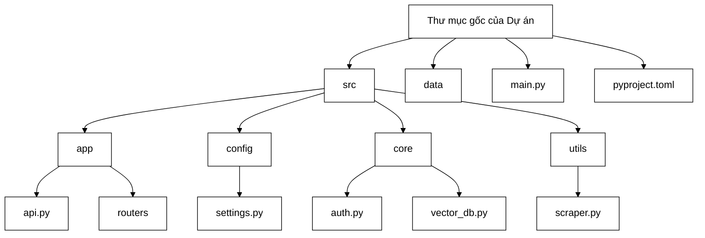

# CHƯƠNG 3: TRIỂN KHAI HỆ THỐNG

## 3.1. Thiết lập môi trường phát triển

Dự án được phân chia thành các phân hệ độc lập nhằm tối ưu hóa quá trình quản trị và bảo trì mã nguồn. Cấu trúc thư mục ngăn cách rõ ràng giữa tầng cấu hình, nghiệp vụ cốt lõi và giao diện quản trị.

*Hình 3.1: Sơ đồ cấu trúc thư mục dự án*

Kiến trúc phần mềm sử dụng khối công nghệ lõi bao gồm FastAPI làm máy chủ điều phối luồng mạng, LangChain thiết lập đường ống xử lý thông tin và cơ sở dữ liệu vector đóng vai trò kho lưu trữ. Việc phát triển theo mô hình nguyên khối phân hệ giúp quản trị viên có thể thay thế mô hình ngôn ngữ khác chỉ bằng cách cấu hình lại tệp môi trường mà không cần can thiệp vào thuật toán truy xuất.

## 3.2. Triển khai phân hệ quản trị người dùng

Trong quá trình xây dựng hệ thống, an toàn thông tin và bảo mật phân quyền là yếu tố bắt buộc đối với một hệ thống cấp trường. Đồ án đã phát triển một phân hệ quản trị tài khoản chuyên biệt, độc lập hoàn toàn với luồng tương tác của trợ lý ảo trên ứng dụng nhắn tin.

### 3.2.1. Cơ chế xác thực và mã hóa
Hệ thống sử dụng cơ sở dữ liệu nội bộ để lưu trữ thông tin. Mật khẩu người dùng không bao giờ được lưu dưới dạng văn bản thô. Hàm băm mật khẩu áp dụng thư viện chuẩn với cơ chế sinh chuỗi ngẫu nhiên phụ trợ tự động. Quá trình đối chiếu mật khẩu đảm bảo chống lại các cuộc tấn công vét cạn và tấn công bằng bảng băm tính trước.

Hệ thống sử dụng cơ chế xác thực mã thông báo chuẩn JWT không lưu trạng thái thay vì sử dụng phiên truyền thống. Khi cán bộ đăng nhập thành công qua cổng xác thực, hệ thống khởi tạo một chuỗi mã chứa định danh người dùng và thời gian hết hạn là 24 giờ. Mọi yêu cầu thao tác dữ liệu từ bảng điều khiển web lên máy chủ đều phải đính kèm chuỗi mã này. Lớp trung gian chịu trách nhiệm giải mã và xác thực quyền hạn trước khi cho phép hàm logic thực thi.

### 3.2.2. Quản lý vòng đời tài khoản và lưu vết
Phân hệ cung cấp bộ giao thức kết nối hoàn chỉnh để quản trị viên cấp cao có thể khởi tạo, cập nhật, xóa và truy xuất danh sách nhân sự. Hệ thống tích hợp logic ràng buộc chặn quản trị viên tự xóa chính tài khoản đang đăng nhập của mình để tránh gây lỗi mất quyền kiểm soát toàn cục.

Mọi hành động nhạy cảm như thêm mới tài khoản, đổi mật khẩu hay xóa quyền truy cập đều được hệ thống tự động lưu vết qua công cụ ghi nhật ký tích hợp sẵn. Điều này giúp minh bạch hóa trách nhiệm và dễ dàng truy vết khi có sự cố thay đổi dữ liệu.

## 3.3. Triển khai phân hệ tự động thu thập dữ liệu

Một trong những thách thức lớn nhất của hệ thống hỏi đáp là việc duy trì sự cập nhật của cơ sở tri thức. Thay vì ép buộc cán bộ tuyển sinh phải tự tải về từng văn bản thông báo trên trang web của trường rồi tải ngược lên hệ thống, đồ án đã phát triển phân hệ cào dữ liệu tự động đóng vai trò như một công cụ tự động hóa quy trình nghiệp vụ.

### 3.3.1. Kiến trúc luồng thu thập dữ liệu
Công cụ thu thập được lập trình để quét mã nguồn của cổng thông tin tuyển sinh. Nó bóc tách các bài viết thông báo mới nhất theo từng danh mục định sẵn. Hệ thống duy trì tệp trạng thái để ghi nhớ mốc thời gian cào dữ liệu gần nhất. Khi kích hoạt thông qua cổng lệnh kiểm tra, hệ thống tiến hành đối chiếu và chỉ tải về những thông báo chưa từng xuất hiện.

### 3.3.2. Xử lý đa luồng và tạo tài liệu động
Để tăng tốc độ quét hàng trăm bài viết, hệ thống sử dụng cơ chế xử lý đa luồng. Việc chạy song song giúp tải các tệp đính kèm như PDF hoặc DOCX cùng một lúc thông qua thư viện kết nối mạng.

Điểm đột phá kỹ thuật nằm ở cơ chế chuyển đổi nội dung web sang định dạng cấu trúc. Nếu bài viết tuyển sinh không có tệp đính kèm mà chỉ có văn bản trực tiếp trên web, hệ thống sẽ dùng công cụ bóc tách để trích xuất văn bản thuần túy và bỏ qua mã rác. Sau đó, hệ thống dùng thư viện xử lý tài liệu để tự động tạo ra một tệp Word mới với tiêu đề chính là tên bài viết, chứa toàn bộ nội dung của bài viết, rồi đẩy tệp này vào luồng tiền xử lý của cơ sở dữ liệu vector. Nhờ đó, máy chủ có thể đọc hiểu cả các thông báo văn bản ngắn trên web.

## 3.4. Triển khai phân hệ quản trị kho tri thức và dữ liệu vector

Luồng nghiệp vụ xử lý dữ liệu của đề tài không dừng lại ở việc thiết lập cơ sở dữ liệu vector, mà bao hàm toàn bộ quy trình kiểm soát trạng thái tệp gốc thông qua mô đun quản lý dữ liệu.

### 3.4.1. Cơ chế xóa và ghi đè thông minh
Trong bối cảnh văn bản hành chính, một quy chế của năm nay có thể sẽ thay thế hoàn toàn bản quy chế năm trước. Nếu cả hai văn bản cùng tồn tại trong kho lưu trữ, mô hình trí tuệ nhân tạo sẽ gặp tình trạng xung đột tri thức. Giao thức xóa tệp giải quyết triệt để bài toán này thông qua luồng xóa đồng bộ. Quy trình bắt đầu bằng việc nhận lệnh xóa từ giao diện web, tiến hành xóa tệp vật lý tương ứng trên máy chủ, và kết nối trực tiếp với cơ sở dữ liệu vector để thanh lọc toàn bộ các điểm dữ liệu thuộc về tệp đó. Cơ chế xóa triệt để này đảm bảo dữ liệu máy học và dữ liệu vật lý luôn đồng nhất.

### 3.4.2. Thống kê và xử lý tệp rác
Cổng thống kê cung cấp cái nhìn toàn cảnh về bộ não nhân tạo, bao gồm tổng số lượng tài liệu vật lý đã tải lên và tổng số mảnh văn bản đã được phân rã thành công. Hệ thống hỗ trợ đường dẫn chuyên dò tìm các tệp không nằm trong danh sách định dạng chuẩn, giúp dọn dẹp không gian lưu trữ rác và các quá trình nhận dạng văn bản thất bại.

## 3.5. Triển khai cơ chế tối ưu hóa hệ thống

Để đảm bảo khả năng chịu tải và tốc độ phản hồi trong mùa cao điểm tuyển sinh, hệ thống tích hợp ba cơ chế tối ưu hóa cấp độ kiến trúc.

### 3.5.1. Cơ chế bộ nhớ đệm ngữ nghĩa
Đây là một điểm sáng nhằm giảm thiểu chi phí dịch vụ và triệt tiêu độ trễ mạng. Thay vì gọi dịch vụ trí tuệ nhân tạo liên tục cho cùng một câu hỏi, hệ thống xây dựng một bảng nhớ đệm ngữ nghĩa cục bộ. 

Khi người dùng hỏi một câu, câu hỏi được nhúng thành vector. Nếu sau đó có người khác hỏi một câu tương tự về mặt ngữ nghĩa, hệ thống không tốn tài nguyên truy xuất lại toàn bộ kho tri thức. Mã nguồn trích xuất các mảng vector từ bảng nhớ đệm, chuyển thành ma trận và sử dụng phép toán đại số tuyến tính để đo lường độ tương đồng. Nếu điểm số đạt ngưỡng khắt khe, hệ thống trả thẳng kết quả cũ từ máy chủ cục bộ với độ trễ siêu thấp. Vòng đời của bộ nhớ đệm được thiết lập là 30 ngày.

### 3.5.2. Kiến trúc đa phương thức và cơ chế chống quá tải
Khi ứng dụng nhận hàng ngàn tin nhắn, việc gọi dịch vụ có thể bị từ chối do chạm mốc giới hạn tài nguyên. Lớp động cơ đa phương thức được bọc bởi thuật toán bẫy lỗi tự động nhận diện tình trạng từ chối dịch vụ. Khi bị từ chối, luồng xử lý không làm treo máy chủ mà sẽ đi vào trạng thái chờ và thực hiện thử lại tối đa 3 lần. Nhờ đó, hệ thống giữ được tính kiên cường cực cao. Mô đun này sử dụng công cụ kết nối mới nhất để tải tệp vật lý trực tiếp lên đám mây, theo dõi vòng đời tệp từ khi xử lý đến khi hoàn tất, và tự động dọn dẹp không gian sau khi thao tác xong.

### 3.5.3. Cơ chế dự phòng thu thập tin nhắn
Ứng dụng tương tác thường hoạt động qua cơ chế đẩy thông báo trực tiếp. Khi hệ thống bảo trì hoặc chạy trong môi trường không có địa chỉ mạng tĩnh, cơ chế này sẽ vô tác dụng. Đồ án xử lý vấn đề này bằng việc cung cấp một tiến trình nền thực hiện cơ chế chờ kết nối dài hạn. Hàm cập nhật liên tục giữ kết nối mạng đến máy chủ trung gian, kiểm soát con trỏ để đảm bảo không bỏ sót bất kỳ tin nhắn nào của thí sinh, tạo thành lưới an toàn hoàn hảo.

## 3.6. Triển khai giao diện lập trình ứng dụng

Hệ thống máy chủ đóng vai trò cầu nối điều khiển luồng giao tiếp mạng thông qua thiết kế chuẩn hóa. Tuyến dịch vụ cốt lõi truyền luồng dữ liệu theo định dạng dòng sự kiện liên tục, mang lại hiệu ứng đối thoại thời gian thực giúp giảm độ trễ hiển thị xuống mức thấp nhất. 

Hệ thống hỗ trợ xử lý luồng nhận thông báo để đồng bộ với hạ tầng máy chủ của ứng dụng nhắn tin, kết hợp với cơ chế chia sẻ tài nguyên chéo nguồn gốc để chấp nhận kết nối đa miền từ bảng điều khiển web. Bảng điều khiển và tập lệnh trình duyệt được phục vụ thông qua công cụ phát tệp tĩnh tích hợp sẵn.

## 3.7. Triển khai giao diện quản trị và ứng dụng người dùng

Người dùng tương tác thông qua nền tảng nhắn tin Zalo. Việc triển khai trực tiếp trên ứng dụng nhắn tin nội bộ loại bỏ rào cản tải phần mềm, giúp quá trình tra cứu thông tin diễn ra mượt mà từ thiết bị di động cá nhân.

[ CHÈN ẢNH ZALO BOT HOẠT ĐỘNG THỰC TẾ VÀO ĐÂY ]

*Hình 3.2: Hệ thống trợ lý ảo đang tư vấn trực tiếp trên nền tảng ứng dụng tin nhắn*

Bảng điều khiển web cung cấp nền tảng quản trị trực quan. Danh sách tài liệu quản lý tập trung phản ánh trạng thái từng tệp bằng mã màu tiêu chuẩn. Giao diện hỗ trợ quản trị viên tải tệp bằng thao tác kéo thả và giám sát quá trình mã hóa vector, kích hoạt bộ cào dữ liệu tự động, và thống kê chỉ số máy chủ.

[ CHÈN ẢNH WEB ADMIN DASHBOARD HOẠT ĐỘNG THỰC TẾ VÀO ĐÂY ]

*Hình 3.3: Giao diện quản trị tri thức trên bảng điều khiển web*
