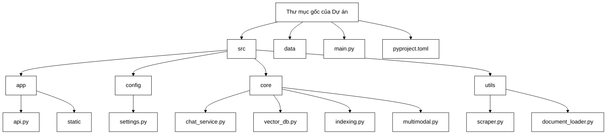
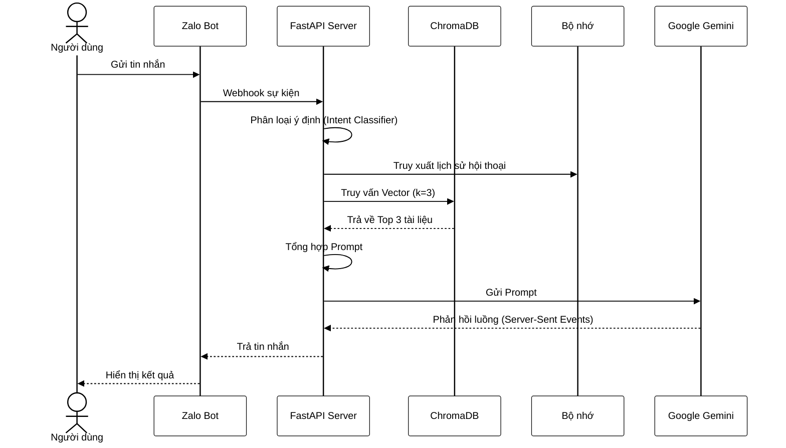

# CHƯƠNG 3: TRIỂN KHAI HỆ THỐNG

## 3.1. Thiết lập môi trường phát triển

Dự án được phân chia thành các mô-đun độc lập nhằm tối ưu hóa quá trình quản trị và bảo trì mã nguồn. Cấu trúc thư mục ngăn cách rõ ràng giữa tầng cấu hình, nghiệp vụ cốt lõi và giao diện quản trị.


*Hình 3.1: Sơ đồ cấu trúc thư mục dự án*

Kiến trúc phần mềm sử dụng khối công nghệ lõi bao gồm FastAPI làm máy chủ điều phối luồng mạng, LangChain thiết lập đường ống xử lý RAG và ChromaDB đóng vai trò cơ sở dữ liệu vector. Hệ thống được phát triển theo mô hình nguyên khối phân hệ. Thiết kế phân tách rõ ràng giữa tầng giao diện, tầng logic RAG và tầng kết nối cơ sở dữ liệu giúp mã nguồn dễ dàng mở rộng. Quản trị viên có thể thay thế mô hình ngôn ngữ khác chỉ bằng cách cấu hình lại tệp môi trường mà không cần can thiệp vào logic truy xuất.

## 3.2. Triển khai mô-đun thu thập dữ liệu

Mô-đun thu thập dữ liệu tự động tích hợp các cơ chế cào thông tin từ cổng thông tin điện tử và trích xuất dữ liệu từ các định dạng tệp khác nhau.

Lớp `TLUAdmissionScraper` kết nối với API nội bộ của nhà trường để tải danh sách thông báo theo từng bậc đào tạo. Thuật toán phân tích cấu trúc HTML bằng `BeautifulSoup` nhằm loại bỏ mã thừa và tìm kiếm các liên kết tải tệp. Để tối ưu hóa hiệu suất dựa trên giới hạn băng thông mạng cục bộ và tài nguyên CPU, hệ thống được cấu hình xử lý đồng thời tối đa 5 luồng tải bằng `ThreadPoolExecutor`. Cơ chế đánh dấu lịch sử quét lưu trữ mã định danh của bài viết đã xử lý, đảm bảo hệ thống chỉ tải và phân tích dữ liệu thuộc các bài báo hoàn toàn mới ở lần quét tiếp theo.

Hệ thống nhận diện phần mở rộng của từng tệp tải về để gọi trình xử lý tương ứng. Lớp `PyPDFLoader` phân tích tệp PDF, trong khi `Docx2txtLoader` trích xuất nội dung từ tệp DOCX nhằm bảo toàn cấu trúc văn bản hành chính. 

Đối với dữ liệu ảnh chứa bảng biểu phức tạp, việc bóc tách thông thường sẽ làm vỡ định dạng hàng cột. Giải pháp kỹ thuật được áp dụng là một đường ống ba bước: sử dụng thư viện OpenCV phát hiện viền bảng, cắt vùng ảnh chứa văn bản, sau đó chuyển giao cho mô hình nhận dạng quang học OCR. Hệ thống tiếp tục sử dụng thuật toán dò tìm tọa độ pixel của các ô chữ, sắp xếp theo trục tọa độ không gian và ánh xạ thành chuỗi ký tự phân cách bằng dấu gạch đứng của cú pháp Markdown. Dữ liệu đầu ra sau đó được hệ thống nạp lại vào luồng xử lý tĩnh nội bộ.

## 3.3. Triển khai mô-đun xử lý và lưu trữ vector

Hệ thống mã hóa kế thừa giao thức chuẩn của LangChain, kết hợp cơ chế phân lô động. Thuật toán Token-Bucket được cấu hình ở tầng luồng mạng để giới hạn tốc độ truy xuất, tuân thủ chặt chẽ định mức truy vấn đám mây bằng cách theo dõi số lượng "token" còn lại trước mỗi đợt gọi API.

```python
# Đoạn mã giả thuật toán Token-Bucket giới hạn luồng mạng
class TokenBucket:
    def __init__(self, rate, capacity):
        self.tokens = capacity
        self.capacity = capacity
        self.rate = rate # Tốc độ hồi phục token/giây
        self.last_update = time.time()
        
    def consume(self, tokens_needed):
        now = time.time()
        self.tokens = min(self.capacity, self.tokens + (now - self.last_update) * self.rate)
        self.last_update = now
        if self.tokens >= tokens_needed:
            self.tokens -= tokens_needed
            return True
        return False
```

Hệ thống tự động chuyển đổi thuộc tính nhiệm vụ tương ứng: thiết lập tham số `retrieval_document` để lập chỉ mục và `retrieval_query` cho câu hỏi. Các ngoại lệ dữ liệu như mảnh văn bản rỗng được xử lý trước để ngăn chặn lỗi đồng loạt.

Cơ sở dữ liệu ChromaDB cục bộ sử dụng lớp `RecursiveCharacterTextSplitter` phân rã văn bản theo ngưỡng 1000 ký tự với độ chồng lấn 200 ký tự. Để giải quyết xung đột khi cập nhật quy định mới, cơ chế ghi đè thông minh tra cứu siêu dữ liệu của tài liệu đích, chủ động xóa bỏ các vector thuộc phiên bản quy chế cũ trước khi nhúng dữ liệu mới vào kho. Lớp `IndexingService` đóng vai trò quản lý chu trình này, đồng bộ trạng thái giữa thư mục lưu trữ tĩnh và kho vector.

## 3.4. Triển khai mô-đun hỏi đáp RAG

Mô-đun hỏi đáp RAG vận hành toàn trình từ khâu tiếp nhận câu hỏi đến sinh phản hồi trực tiếp. 

Tại lớp giao tiếp lõi, API Google Gemini hoạt động với cấu hình nhiệt độ bằng không nhằm cung cấp kết quả tất định, loại trừ hiện tượng sinh chuỗi thông tin ảo. Quá trình kết xuất nội dung kết hợp thuật toán thử lại tự động khi nhận mã lỗi quá tải băng thông 429 từ máy chủ cung cấp dịch vụ, đảm bảo tính ổn định trong giờ cao điểm.

Hàm phản hồi điều phối logic hệ thống trả lời Zalo. Để lọc các tin nhắn đơn giản, luồng dữ liệu đi qua mô hình phân loại ý định kết hợp bộ lọc biểu thức chính quy. Cơ chế này nhận diện nhanh chóng các câu chào hỏi xã giao để điều hướng sang kịch bản tĩnh định sẵn, lược bỏ khâu truy vấn vector tài nguyên lớn. Đối với câu hỏi nghiệp vụ, hệ thống tra cứu ChromaDB để trích xuất giới hạn 3 đoạn tài liệu có độ tương quan cao nhất.

Bộ nhớ hội thoại `ConversationBufferMemory` của LangChain tích hợp lịch sử truy vấn, duy trì mạch tư vấn xuyên suốt. Bằng cách nối khung chỉ thị, nội dung truy xuất, lịch sử bộ nhớ và câu hỏi thực tại, ứng dụng gửi tệp ngữ cảnh hoàn chỉnh đến mô hình ngôn ngữ và trả chuỗi phản hồi trực tiếp về thiết bị đầu cuối.


*Hình 3.2: Biểu đồ tuần tự luồng hỏi đáp RAG*

## 3.5. Triển khai API Backend (FastAPI)

FastAPI đóng vai trò cầu nối điều khiển luồng giao tiếp mạng thông qua thiết kế RESTful.

Tuyến dịch vụ cốt lõi truyền luồng dữ liệu định dạng kết nối dòng sự kiện liên tục, mang lại hiệu ứng đối thoại thời gian thực. Các tuyến API quản trị bao gồm trích xuất thông số vận hành, liệt kê tệp tĩnh, và xử lý nhúng dữ liệu thủ công. Hệ thống hỗ trợ xử lý luồng Webhook để đồng bộ với ứng dụng Zalo, kết hợp với Middleware CORS để chấp nhận kết nối đa miền. Bảng điều khiển HTML và tập lệnh trình duyệt được phục vụ thông qua công cụ phát tệp tĩnh tích hợp sẵn.

## 3.6. Triển khai giao diện Web Admin

Bảng điều khiển Web Admin cung cấp nền tảng quản trị trực quan. 

Danh sách tài liệu quản lý tập trung phản ánh trạng thái từng tệp bằng mã màu tiêu chuẩn. Giao diện hỗ trợ quản trị viên tải tệp bằng thao tác kéo thả và giám sát quá trình mã hóa vector. Các khối lệnh chức năng hỗ trợ quét dữ liệu tự động từ nguồn bên ngoài, gọi mô hình xử lý hình ảnh, và tái lập chỉ mục cục bộ. Hệ thống bảng tóm tắt số liệu hoạt động hỗ trợ đánh giá tổng quan dung lượng tri thức RAG và phân loại tình trạng hệ thống.
